```{r preamble, echo = FALSE, eval = TRUE, cache = FALSE, message = FALSE, warning = FALSE}
## (a) Housekeeping: -----
# rm(list=ls()) # clean all.

## (b) Current file name and path: ----- 
# cur.path <- dirname(rstudioapi::getActiveDocumentContext()$path)
# cur.path
# setwd(cur.path) # set to current directory
# setwd("~/Desktop/stuff/Dropbox/_code/R/_teachR/ds4psy/_art/") # set to current directory
# list.files() # all files + folders in current directory
fileName <- "art.Rmd"

## (c) Packages: ----- 
library(rmarkdown)
library(rmdformats)
library(knitr)
library(tidyverse)
library(cowplot)
library(here)
library(unikn)

## (d) Global options: ----- 
options(max.print = "75")
opts_chunk$set(echo = TRUE,
	             cache = FALSE,
               prompt = FALSE,
               tidy = FALSE,
               collapse = TRUE, # set TRUE in answers 
               comment = "#>",
               message = FALSE,
               warning = FALSE,
               ## Default figure options:
               fig.width = 6, 
               fig.asp = .618, # golden ratio
               out.width = "75%",
               fig.align = "center"
               )
opts_knit$set(width = 75)

## (e) Custom functions: ----- 
# source(file = here("R", "custom_functions.R"))
## WAS: 
# source(file = "~/Desktop/stuff/Dropbox/_code/R/_teachR/ds4psy/R/custom_functions.R")

# Define some paths: ------
pic_path <- here("images")
# WAS: pic_path <- "./../images/"
plot_out <- pic_path 

# plotting parameters: 
opar <- par(no.readonly = TRUE)  # all par settings that can be changed.
```

<!-- ds4psy logo and link: -->
<a href="http://rpository.com/ds4psy/">

</a>

# Course Coordinates

<!-- uni.kn logo, but link to SPDS: -->  
<!--  --> 
<a href="https://www.spds.uni-konstanz.de/">

<!-- 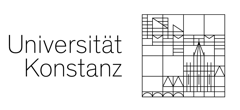 --> 
</a>

<!-- Winter 2018: --> 

* Taught at the [University of Konstanz](https://www.uni-konstanz.de/) by [Hansjörg Neth](http://neth.de/) (<h.neth@uni.kn>,  [SPDS](https://www.spds.uni-konstanz.de/), office D507). 

* Winter 2018/2019: Mondays, 13:30--15:00, C511. 

* Links to current [course syllabus](http://rpository.com/ds4psy/) | [ZeUS](https://zeus.uni-konstanz.de/hioserver/pages/startFlow.xhtml?_flowId=detailView-flow&unitId=5101&periodId=78&navigationPosition=hisinoneLehrorganisation,examEventOverviewOwn) |  [Ilias](https://ilias.uni-konstanz.de/ilias/goto_ilias_uni_crs_809936.html) 


# Artwork

Overview over generated plots: 

## Logo

Different ds4psy logo options (created in pkg `rtwrk`):


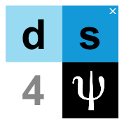


## Tiles

Showing the versions _with_ borders:

### Tile plots (random)


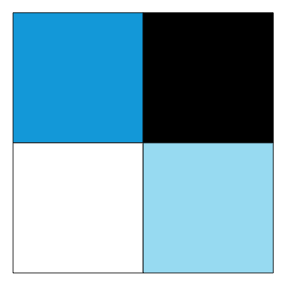

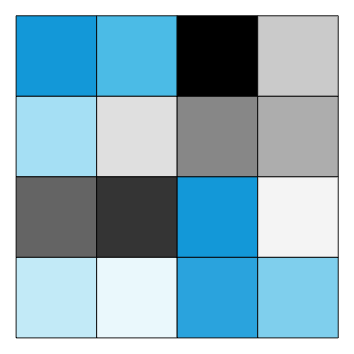
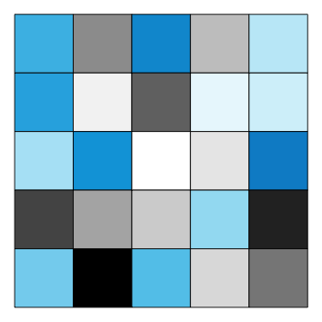

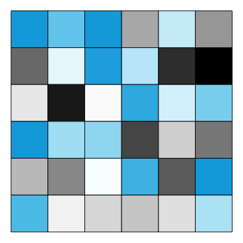
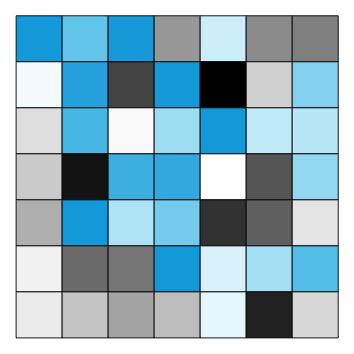
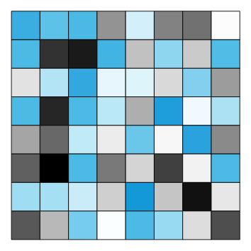

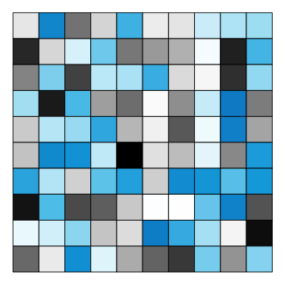

### Tile plots (sorted)


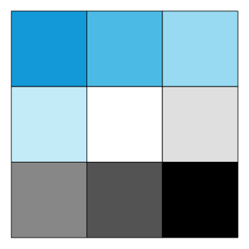

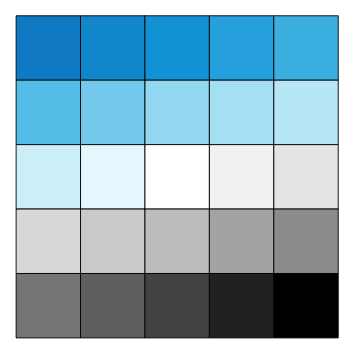


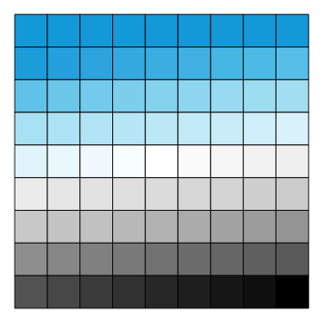


### Tile plots (with borders and numeric labels)

Random versions:


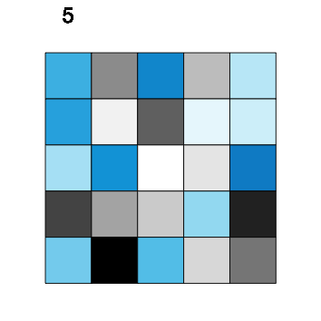


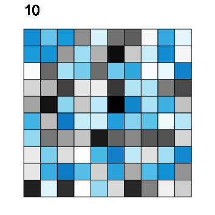


Sorted versions:

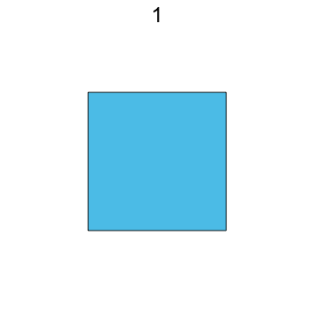
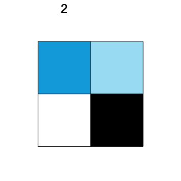
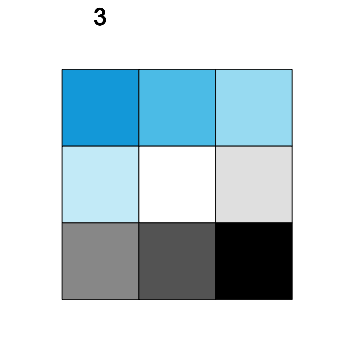


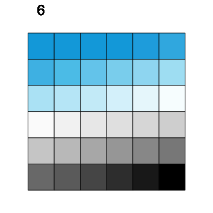

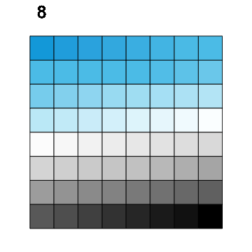
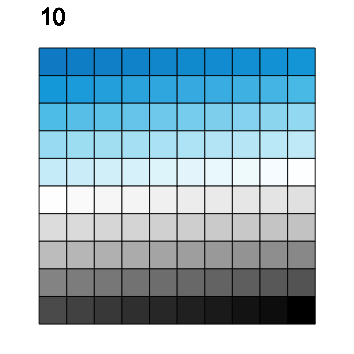
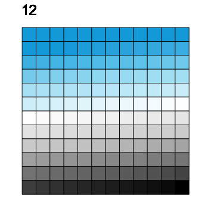


## Poles

Showing the versions _without_ borders:

### Pole plots (random)


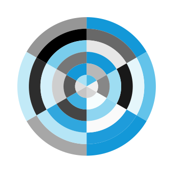


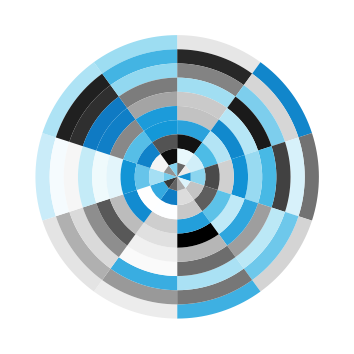

### Pole plots (sorted)


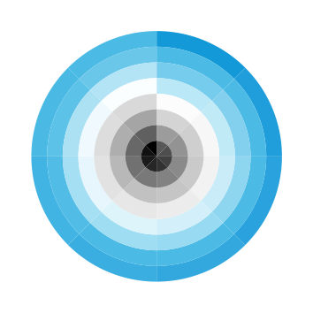


### Pole plots (with borders and numeric labels)

Random versions:


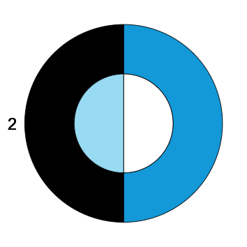


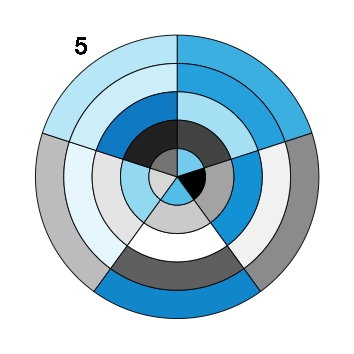
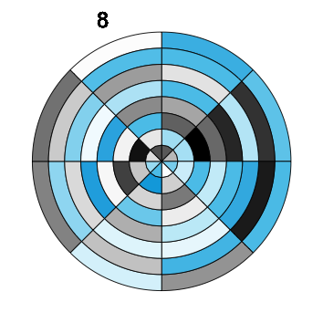
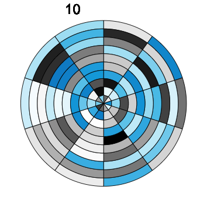

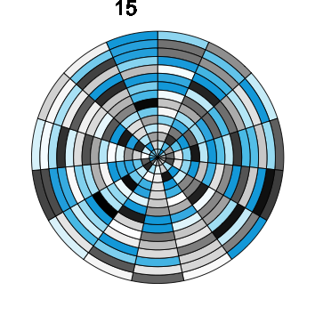

Sorted versions:

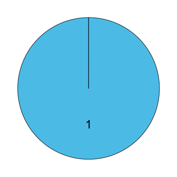


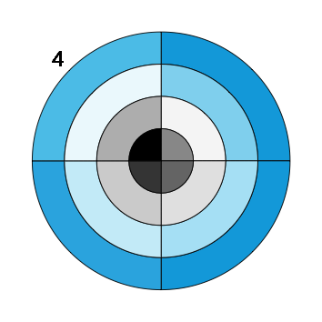
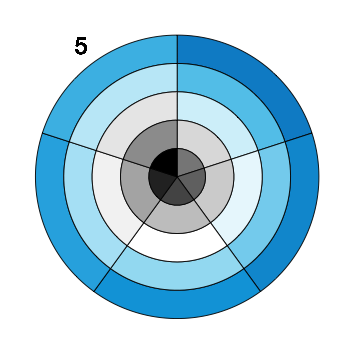

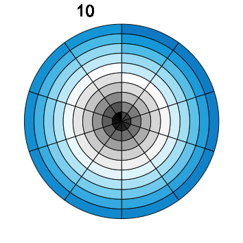
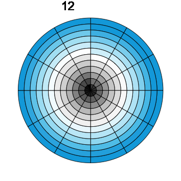
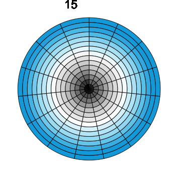


## Text

### Text labels

```{r text_labels}
# Define text labels: ------ 
course_title <- paste0("Data science for psychologists")
course_title_abb <- paste0("ds4psy")
psi <- expression(psi)

name_hn <- "Hansjörg Neth"
name_course <- paste0(name_hn, ":", " ", course_title)
# name_course
```

Course labels:

- `course_title` = `r course_title`
- `course_title_abb` = `r course_title_abb`
- `psi` = `r psi`

## Colors

### Color palettes 

```{r colors, eval = FALSE}
library(unikn)  # NEW: dedicated package, loaded in R/custom_functions.R

## Re-sort color palette: 
# unikn.pal  # from "ds4psy/R/custom_functions.R""

## Define colors and color palettes. 

## Define individual colors: ------

seeblau <- rgb(0, 169, 224, names = "seeblau", maxColorValue = 255) # seeblau.4 (non-transparent)

## Source: https://www.uni-konstanz.de/en/university/news-and-media/create-online-and-print-media/corporate-design/the-university-of-konstanzs-corporate-design/ 

## Define color palettes: ------

## (A) Web (sRGB) scale: ---- 

# pal_unikn = data.frame(                                 ## as df: 
#   "seeblau1" = rgb(204, 238, 249, maxColorValue = 255), #  1. seeblau1 (non-transparent)
#   "seeblau2" = rgb(166, 225, 244, maxColorValue = 255), #  2. seeblau2 (non-transparent)
#   "seeblau3" = rgb( 89, 199, 235, maxColorValue = 255), #  3. seeblau3 (non-transparent)
#   "seeblau4" = rgb(  0, 169, 224, maxColorValue = 255), #  4. seeblau4 (= seeblau base color)
#   "black"    = rgb(  0,   0,   0, maxColorValue = 255), #  5. black
#   "seegrau4" = rgb(102, 102, 102, maxColorValue = 255), #  6. grey40 (non-transparent)
#   "seegrau3" = rgb(153, 153, 153, maxColorValue = 255), #  7. grey60 (non-transparent)
#   "seegrau2" = rgb(204, 204, 204, maxColorValue = 255), #  8. grey80 (non-transparent)
#   "seegrau1" = rgb(229, 229, 229, maxColorValue = 255), #  9. grey90 (non-transparent)
#   "white"    = rgb(255, 255, 255, maxColorValue = 255), # 10. white
#   stringsAsFactors = FALSE)
# # pal_unikn

# Note: Web (sRGB) colors appear to be more vibrant.

# # Sensibly sorted version:
# pal_unikn <- pal_unikn[c(4:1, 10:5)] # seeblau (1) > white (5) > grey > black (10)

### Check:
# pal_unikn
# # => 
# #   seeblau4 seeblau3 seeblau2 seeblau1   white seegrau1 seegrau2 seegrau3 seegrau4   black
# # 1  #00A9E0  #59C7EB  #A6E1F4  #CCEEF9 #FFFFFF  #E5E5E5  #CCCCCC  #999999  #666666 #000000

## (B) PowerPoint scale: ---- 

# pal_unikn_ppt = data.frame(                                 ## as df: 
#   "seeblau1" = rgb(200, 229, 239, maxColorValue = 255), #  1. seeblau1 (non-transparent)
#   "seeblau2" = rgb(160, 211, 230, maxColorValue = 255), #  2. seeblau2 (non-transparent)
#   "seeblau3" = rgb( 89, 182, 220, maxColorValue = 255), #  3. seeblau3 (non-transparent)
#   "seeblau4" = rgb(  0, 154, 209, maxColorValue = 255), #  4. seeblau4 (= seeblau base color)
#   "black"    = rgb(  0,   0,   0, maxColorValue = 255), #  5. black
#   "seegrau4" = rgb(102, 102, 102, maxColorValue = 255), #  6. grey40 (non-transparent)
#   "seegrau3" = rgb(153, 153, 153, maxColorValue = 255), #  7. grey60 (non-transparent)
#   "seegrau2" = rgb(204, 204, 204, maxColorValue = 255), #  8. grey80 (non-transparent)
#   "seegrau1" = rgb(229, 229, 229, maxColorValue = 255), #  9. grey90 (non-transparent)
#   "white"    = rgb(255, 255, 255, maxColorValue = 255), # 10. white
#   stringsAsFactors = FALSE)

# Note: PowerPoint colors appear to be more muted, less vibrant.

## Sensibly sorted version:
# pal_unikn_ppt <- pal_unikn_ppt[c(4:1, 10:5)] # seeblau (1) > white (5) > grey > black (10)

### Check:
# pal_unikn_ppt
# # => 
# #   seeblau4 seeblau3 seeblau2 seeblau1   white seegrau1 seegrau2 seegrau3 seegrau4   black
# # 1  #009AD1  #59B6DC  #A0D3E6  #C8E5EF #FFFFFF  #E5E5E5  #CCCCCC  #999999  #666666 #000000

## Function to get (n x n) colors of a palette: ------ 

col_n_sq <- function(n = 10, pal = pal_unikn){
  
  out <- NA
  
  if (n == 1) {
    
    out <- pal[1] #  1 color: seeblau4
    
  } else if (n == 2) {
    
    out <- pal[c(1, 3, 5, 10)]   #  4 colors: seeblau4, seeblau2, white, black
    
  } else if (n == 3) {
    
    out <- pal[-7] #  9 colors: seeblau > white > black
    
  } else {
    
    out <- pal[c(1, 1:10)]   # 11 colors: seeblau (2x) > white (6 = mid) > black (11) [default]
    
  }
  
  return(out)
  
}

## Check:
# col_n_sq(1)
# col_n_sq(2)
# col_n_sq(3)
# col_n_sq(4)

# Reset:
unikn.pal <- pal_unikn

# seecol(unikn.pal)
```


### Plot themes

```{r plot_parameters}
ds_theme <- theme_bw() + 
  theme(panel.grid = element_blank(),
        legend.position = "none",
        axis.text = element_blank(),
        axis.ticks = element_blank(),
        panel.background = element_rect(fill = "white"),
        panel.border = element_rect(color = grey(.25, 1)))

ds_theme <- theme_nothing()

## ToDo: Define a generic ds4psy ggplot theme.

theme_ds4psy <- ds_theme
```

### Logo

Corresponding logo (see code in project **rtwrk** for more recent version):

```{r logo_sketch, eval = TRUE, fig.width = 2, fig.height = 2}
# Define some positions: ------

dx <- 1
dy <- 1
dd <- 1

# Table: ------

tb_ds4p <- tibble::tribble(
  ~sym, ~x, ~y,
  "d",   -dx,  +dy,
  "s",   +dx,  +dy,
  "4",   -dx,  -dy,
  "psy", +dx,  -dy )
tb_ds4p$row <- 1:nrow(tb_ds4p)
tb_ds4p

# Colors: ------ 

## Based on pal_unikn:

pal_unikn <- unikn::pal_unikn  # WAS: unikn.pal

# col_4 <- col_n_sq(n = 2, pal_unikn)
# col_4
# => 
#   seeblau4 seeblau2   white   black
# 1  #00A9E0  #A6E1F4 #FFFFFF #000000

col_4 <- pal_unikn[c("seeblau2", "seeblau4", "white", "black")]
# col_4
# => 
#   seeblau4 seeblau2   white   black
# 1  #00A9E0  #A6E1F4 #FFFFFF #000000

seegrau1 <- pal_unikn[["seegrau1"]] 
# seegrau1
# => 
#   seegrau1
# 1  #E5E5E5

# Parameters: ------ 

txt_size <- 5.00
c_shift  <- 0.80

# Plot: ------

plot_plot <- TRUE

if (plot_plot) {
  
  logo <- ggplot2::ggplot(tb_ds4p) +
    geom_tile(aes(x = x, y = y, fill = row)) + 
    # Add points: 
    geom_point(x = (+dx + c_shift * dx), y = (dy + c_shift * dy), pch = 4, size = 1, col = "white") +  # mark coordinate with "x"
    # geom_point(x = (-dx), y = (-dy), pch = 16, size = 11, col = seegrau1) +                          # mark coordinate with "O"
    # Add text: 
    geom_text(aes(x = x, y = y, label = sym), col = grey(0.0, 1.0), size = txt_size, family = "Arial", fontface = 2, adj = .5) +  # 4 text elements
    geom_text(x = dx, y = -dy, label = expression(psi), col = grey(1.0, 1.0), size = (txt_size + 1), family = "Arial", fontface = 2, adj = .5) +    # psi in lower right  
    # Set scales:
    scale_x_continuous(limits = c((-dx - dd), (+dx + dd))) +
    scale_y_continuous(limits = c((-dy - dd), (+dy + dd))) +
    scale_fill_gradientn(colors = col_4) + 
    coord_fixed() +
    theme_ds4psy
  logo
  
  ## Save plot: ------ 
  
  plot_name <- "logo_cur"
  full_name <- paste0(plot_out, "/", plot_name, ".png")
  
  # ggsave(full_name, width = 2, height = 2, units = c("cm"), dpi = 300)
  
} # if (plot_plot) etc. 
```

**Note:** This version of the logo is obsolete. 
Check project **rtwrk** for more current versions.


### Theme

**ToDo:** Create a dedicated **ds4psy** ggplot theme.


### Leet slang (l33t)

**ToDo:** Put in _Strings and text_ data chapter.

See <https://simple.wikipedia.org/wiki/Leet> for details. 

```{r l33t_labels}
## Using leet / l33t slang: ------
                             # l33t rul35: 
n4me <- "h4n5j03Rg n3+h"     # e:3, a:4, s:5, o:0, t:+, r:R
d5   <- "d4+4 5c13nc3"       # i:1 
fp   <- "f0R p5ych0l0g15+5"
course_l33t <- paste0(n4me, ":", " ", d5, " ", fp)
course_l33t

## Automation: ----- 

txt  <- "This is a short test string with some text to leetify."
txt2 <- "Data science is both a craft and an art. This course introduces fundamental data types, basic concepts and commands of the R programming language, and explores key packages of the so-called tidyverse. Regular exercises will help you to make your first steps from R novice to user."

# Write functions to:  
# - switch text to lower/upper case, capitalize, etc.
# - leetify a string of text (with sets of rules)
# - mix content (letters, words, ...) with noise (punctuation, space, random characters)

# l33t rules: ------ 
l33t_num <- c("a" = "4", "A" = "4", 
              "e" = "3", "E" = "3", 
              "i" = "1", "I" = "1", 
              "o" = "0", "O" = "0", 
              "s" = "5", "S" = "5", 
              "T" = "7"
              )

my_l33t <- c("t" = "+",
             "r" = "R"
             ) 

l33t_rul35 <- c(l33t_num, my_l33t)
l33t_rul35

## l33t function: ----- 
str_replace_all(txt, l33t_rul35)

transl33t <- function(txt, rules = l33t_rul35,
                      in_case = "no", out_case = "no") {
  
  # robustness: 
  in_case  <- tolower(substr(in_case,  1 , 2))  # 1st 2 letters of in_case
  out_case <- tolower(substr(out_case, 1 , 2))  # 1st 2 letters of out_case  
  
  # handle in_case: 
  if (in_case == "lo") {
    txt <- tolower(txt)
  } else if (in_case == "up") {
    txt <- toupper(txt)
  }

  # transl33t based on rules:   
  out <- str_replace_all(txt, rules)
  
  # handle out_case: 
  if (out_case == "lo") {
    out <- tolower(out)
  } else  if (out_case == "up") {
    out <- toupper(out)
  }
  
  return(out)
  
}

## Check: 
transl33t(txt, rules = c("a" = "4"))
transl33t(txt)
transl33t(txt = c(txt, txt2))
transl33t(txt = c(letters, LETTERS))

# 9 variants:
transl33t(txt)  # leave in_case and out_case as is.
transl33t(txt,  in_case = "lo")
transl33t(txt,  in_case = "up")
transl33t(txt, out_case = "lo")
transl33t(txt, out_case = "up")
transl33t(txt,  in_case = "lo", out_case = "lo")
transl33t(txt,  in_case = "lo", out_case = "up")
transl33t(txt,  in_case = "up", out_case = "lo")
transl33t(txt,  in_case = "up", out_case = "up")
```

## Data

Table `tb` with sorted and random series from 1 to `N` values (and corresponding colors, etc.): 

```{r tb_data}
# Dimensions:
n_rand <- sample(1:15, size = 1, replace = TRUE)  # random integer (1:15)

n_x <- n_rand  # random number
n_x <- 5       # a specific number
n_y <- n_x
N <- (n_x * n_y)

# Vectors: 
v_sort <- 1:N         # Tile: top_left = seeblau, bottom_right = black   | Polar: outer = seeblau, center = black.
# v_sort <- rev(1:N)  # Tile: top_left = black,   bottom_right = seeblau | Polar: outer = black, center = seeblau.

# Colors for current n_x (to generate n^2 colors in total): 

# WAS: 
# unikn_sort <- col_n_sq(n_x)

# NOW using new pkg: 
library(unikn) 

pal_n_sq <- function(n = "all", pal = unikn::pal_unikn){
  
  # handle inputs:
  stopifnot(length(pal) > 0)
  
  if (is.character(n) && tolower(n) == "all") { n <- length(pal) }
  stopifnot(is.numeric(n))
  stopifnot(n > 0)
  
  out <- NA    # initialize
  
  if (n == 1) {
    
    out <- pal[3]  #  1 preferred color: seeblau3
    
  } else if (n == 2) {
    
    out <- pal[c(2, 4, 6, 10)]  #  4 colors: seeblau4, seeblau2, white, grey
    
  } else if (n == 3) {
    
    out <- pal[-7]  #  9 colors: seeblau > white > black
    
  } else { # n > 3: 9+ colors: 
    
    if (isTRUE(all.equal(pal, pal_unikn))) {
      
      # out <- pal[c(1:2, 2:10)]   # 11 colors: Seeblau (seeblau.3: 2x) > white (6 = mid) > black (11) [default]  
      
      out <- pal_unikn        # 11 colors: seeblau.5 > white (6 = mid) > black (11)  
      
    } else { # any other pal:
      
      out <- pal
      
    }
    
  } # if (n == etc.)
  
  return(out)
  
}

## Colors: 
unikn_sort <- pal_n_sq(n = n_x, pal = pal_unikn)

## bunt colors:
# pal_bunt <- usecol(c(pal_unikn, Karpfenblau, rev(pal_seeblau), pal_seegruen, pal_petrol, pal_bordeaux, "white", pal_grau, "black"))
## seecol(pal_bunt)
# unikn_sort <- pal_n_sq(n = n_x, pal = pal_bunt)
# unikn_sort 

# Colors of text labels:
col_sort <- rep("white", N)  # default
lim_black <- .245  # threshold to switch from "white" to "black" labels
col_sort[(v_sort > (lim_black * N)) & (v_sort < ((1 - lim_black) * N))] <- "black"
# table(col_sort)

# Random order: 
set.seed(815)  # for reproducible randomness

# v_rand <- runif(n = N, 0, 1)
rand_ord <- sample(v_sort, N)   # random permutation of v_sort
v_rand   <- rand_ord            # random permutation of v_sort
col_rand <- col_sort[rand_ord]  # corresponding colors

# Table: 
tb <- tibble::tibble(x = rep(1:n_y, times = n_x),
                     y = rep(n_x:1, each = n_y),
                     sort = v_sort,
                     rand = v_rand,
                     col_sort = col_sort,
                     col_rand = col_rand
)
tb
```

More data: See table of session topics in `toc` below.

## Tiles

### Tile plots 

1. _With_ thin borders:

```{r tile_plots_brd, fig.width = 3, fig.height = 3}
# Parameters: 
brd_col <- grey(0, 1)
brd_size <- .10

plot_size <-  3.0  # NORMAL: in cm (used in ggsave below): normal (small) size
# plot_size <- 10.0  # BIG:    in cm (used in ggsave below): when "./../images/big_"
lbl_size <- 1.5

# Tile plots: ------ 

# (1a) random version (WITH border lines):
tile_rand <- ggplot(tb) +
  geom_tile(aes(x = x, y = y, fill = rand), col = brd_col, size = brd_size) +
  # geom_text(aes(x = x, y = y, label = rand), col = col_rand, size = lbl_size) +  # with tile labels 
  coord_fixed() + 
  # labs(title = "ds4psy") + 
  labs(x = "Data", y = "Science") +
  ## Color schemes: 
  # scale_fill_continuous(low = Seeblau, high = grey(1, 1)) +   # s1: light: Seeblau > white
  scale_fill_gradientn(colors = unikn_sort) +                   # s2: full unikn_sort palette: Seeblau > white > black [default]
  # scale_fill_gradientn(colors = c(unikn_sort, "gold")) +      # s3: highlight final row
  ds_theme
  # theme_bw()
tile_rand

# Save current plot: 
cur_name <- paste0("tile_rand_", n_x, "_brd.png")
# cur_name <- paste0("tile_rand_", n_x, "_brd_col.png")

if (plot_size < 10) {
  plot_name <- paste0(pic_path, "/tile/", cur_name)  # insert sub-dir "tile"
} else {
  plot_name <- paste0(pic_path, "/big/", "big_", cur_name)  # sub-dir "big" and insert "big_" prefix
}
ggsave(plot_name, width = plot_size, height = plot_size, units = c("cm"), dpi = 300)

# (1b) sorted version (WITH border lines):
tile_sort <- ggplot(tb) +
  geom_tile(aes(x = x, y = y, fill = sort), col = brd_col, size = brd_size) +
  # geom_text(aes(x = x, y = y, label = sort), col = col_sort, size = lbl_size) +  # with tile labels
  # coord_polar() +
  coord_fixed() + 
  # labs(title = "ds4psy") + 
  labs(x = "4", y = expression(psi)) +
  ## Color schemes: 
  # scale_fill_continuous(low = Seeblau, high = grey(1, 1)) +   # s1: light: Seeblau > white
  scale_fill_gradientn(colors = unikn_sort) +                   # s2: full unikn_sort palette: Seeblau > white > black [default]
  # scale_fill_gradientn(colors = c(unikn_sort, "gold")) +      # s3: highlight final row
  ds_theme
tile_sort

# Save current plot: 
cur_name <- paste0("tile_sort_", n_x, "_brd.png")
# cur_name <- paste0("tile_sort_", n_x, "_brd_col.png")

if (plot_size < 10) {
  plot_name <- paste0(pic_path, "/tile/", cur_name)
} else {
  plot_name <- paste0(pic_path, "/big/", "big_", cur_name)  # insert "big_" prefix
}
ggsave(plot_name, width = plot_size, height = plot_size, units = c("cm"), dpi = 300)
```

2. _Without_ thin borders:

```{r tile_plots_brdless, fig.width = 3, fig.height = 3}
# Tile plots: ------ 

# (2a) random version (withOUT border lines):
tile_rand <- ggplot(tb) +
  geom_tile(aes(x = x, y = y, fill = rand))+ #, col = brd_col, size = brd_size) +
  coord_fixed() + 
  # labs(title = "ds4psy") + 
  labs(x = "Data", y = "Science") +
  ## Color schemes: 
  # scale_fill_continuous(low = Seeblau, high = grey(1, 1)) +   # s1: light: Seeblau > white
  scale_fill_gradientn(colors = unikn_sort) +                   # s2: full unikn_sort palette: Seeblau > white > black [default]
  # scale_fill_gradientn(colors = c(unikn_sort, "gold")) +      # s3: highlight final row
  ds_theme
tile_rand

# Save current plot: 
cur_name <- paste0("tile_rand_", n_x, ".png")
if (plot_size < 10) {
  plot_name <- paste0(pic_path, "/tile/", cur_name)
} else {
  plot_name <- paste0(pic_path, "/big/", "big_", cur_name)  # insert "big_" prefix
}

ggsave(plot_name, width = plot_size, height = plot_size, units = c("cm"), dpi = 300)

# (2b) sorted version (withOUT border lines):

tile_sort <- ggplot(tb) +
  geom_tile(aes(x = x, y = y, fill = sort))+ #, col = brd_col, size = brd_size) +
  # coord_polar() +
  coord_fixed() + 
  # labs(title = "ds4psy") + 
  labs(x = "4", y = expression(psi)) +
  ## Color schemes: 
  # scale_fill_continuous(low = Seeblau, high = grey(1, 1)) +   # s1: light: Seeblau > white
  scale_fill_gradientn(colors = unikn_sort) +                   # s2: full unikn_sort palette: Seeblau > white > black [default]
  # scale_fill_gradientn(colors = c(unikn_sort, "gold")) +      # s3: highlight final row
  ds_theme
tile_sort

# Save current plot: 
cur_name <- paste0("tile_sort_", n_x, ".png")
if (plot_size < 10) {
  plot_name <- paste0(pic_path, "/tile/", cur_name)
} else {
  plot_name <- paste0(pic_path, "/big/", "big_", cur_name)  # insert "big_" prefix
}

ggsave(plot_name, width = plot_size, height = plot_size, units = c("cm"), dpi = 300)
```

3. With thin borders and a numeric label (top left):

```{r tile_plots_brd_lbl, fig.width = 3, fig.height = 3}
# Parameters:
cur_lbl <- paste0(n_x)

x_lbl <- 1 
y_lbl <- (n_y + 1) + n_y/15

# Tile plots: ------ 

# (3a) random version (WITH border lines AND label):
tile_rand_lbl <- ggplot(tb) +
  geom_tile(aes(x = x, y = y, fill = rand), col = brd_col, size = brd_size) +
  geom_text(x = x_lbl, y = y_lbl, label = cur_lbl, size = 2) +
  scale_y_continuous(limits = c(0, y_lbl)) + 
  # geom_text(x = 0, y = n_y, label = cur_lbl, size = 2) +
  # scale_x_continuous(limits = c(0, n_x + 1)) + 
  coord_fixed() + 
  # labs(title = "ds4psy") + 
  labs(x = "Data", y = "Science") +
  ## Color schemes: 
  # scale_fill_continuous(low = Seeblau, high = grey(1, 1)) +   # s1: light: Seeblau > white
  scale_fill_gradientn(colors = unikn_sort) +                   # s2: full unikn_sort palette: Seeblau > white > black [default]
  # scale_fill_gradientn(colors = c(unikn_sort, "gold")) +      # s3: highlight final row
  ds_theme
tile_rand_lbl

# Save current plot: 
cur_name <- paste0("tile_rand_", n_x, "_brd_lbl.png")
if (plot_size < 10) {
  plot_name <- paste0(pic_path, "/tile/", cur_name)
} else {
  plot_name <- paste0(pic_path, "/big/", "big_", cur_name)  # insert "big_" prefix
}
ggsave(plot_name, width = plot_size, height = plot_size, units = c("cm"), dpi = 300)


# (3b) sorted version (WITH border lines AND label):
tile_sort_lbl <- ggplot(tb) +
  geom_tile(aes(x = x, y = y, fill = sort), col = brd_col, size = brd_size) +
  geom_text(x = x_lbl, y = y_lbl, label = cur_lbl, size = 2) +
  scale_y_continuous(limits = c(0, y_lbl)) + 
  # geom_text(x = 0, y = n_y, label = cur_lbl, size = 2) +
  # scale_x_continuous(limits = c(0, n_x + 1)) + 
  coord_fixed() + 
  # labs(title = "ds4psy") + 
  labs(x = "Data", y = "Science") +
  ## Color schemes: 
  # scale_fill_continuous(low = Seeblau, high = grey(1, 1)) +   # s1: light: Seeblau > white
  scale_fill_gradientn(colors = unikn_sort) +                   # s2: full unikn_sort palette: Seeblau > white > black [default]
  # scale_fill_gradientn(colors = c(unikn_sort, "gold")) +      # s3: highlight final row
  ds_theme
tile_sort_lbl

# Save current plot: 
cur_name <- paste0("tile_sort_", n_x, "_brd_lbl.png")
if (plot_size < 10) {
  plot_name <- paste0(pic_path, "/tile/", cur_name)
} else {
  plot_name <- paste0(pic_path, "/big/", "big_", cur_name)  # insert "big_" prefix
}
ggsave(plot_name, width = plot_size, height = plot_size, units = c("cm"), dpi = 300)
```

**ToDo**: 

In sorted tile plots: 

- Change order of sorted tiles (so that black is at bottom right corner).  [done]
- Consider highlighting one row in a different color (e.g., gold to orange). [done]
- Consider adding 1 differently colored tile (e.g., draw bottom right corner in gold or red color).


### Polar plots

1. _With_ thin borders:

```{r polar_plots_brd, fig.width = 3, fig.height = 3}
# Polar plots: ------ 

pole_rand <- ggplot(tb) +
  geom_tile(aes(x = x, y = y, fill = rand), col = brd_col, size = brd_size) +
  # labs(title = "ds4psy") + 
  coord_polar() + 
  labs(x = "Data", y = "Science") +
  ## Color schemes: 
  # scale_fill_continuous(low = Seeblau, high = grey(1, 1)) +   # s1: light: Seeblau > white
  scale_fill_gradientn(colors = unikn_sort) +                   # s2: full unikn_sort palette: Seeblau > white > black [default]
  # scale_fill_gradientn(colors = c(unikn_sort, "gold")) +      # s3: highlight final row
  ds_theme
pole_rand

# Save current plot: 
plot_name <- paste0("./../images/pole/pole_rand_", n_x, "_brd.png")
ggsave(plot_name, width = plot_size, height = plot_size, units = c("cm"), dpi = 300)

pole_sort <- ggplot(tb) +
  geom_tile(aes(x = x, y = y, fill = sort), col = brd_col, size = brd_size) +
  labs(x = "4", y = expression(psi)) +
  coord_polar() +
  ## Color schemes: 
  # scale_fill_continuous(low = Seeblau, high = grey(1, 1)) +   # s1: light: Seeblau > white
  scale_fill_gradientn(colors = unikn_sort) +                   # s2: full unikn_sort palette: Seeblau > white > black [default]
  # scale_fill_gradientn(colors = c(unikn_sort, "gold")) +      # s3: highlight final row
  ds_theme
pole_sort

# Save current plot: 
plot_name <- paste0("./../images/pole/pole_sort_", n_x, "_brd.png")
ggsave(plot_name, width = plot_size, height = plot_size, units = c("cm"), dpi = 300)
```

2. _Without_ thin borders:

```{r polar_plots_brdless, fig.width = 3, fig.height = 3}
# Polar plots: ------ 

pole_rand <- ggplot(tb) +
  geom_tile(aes(x = x, y = y, fill = rand)) + # , col = brd_col, size = brd_size) +
  # labs(title = "ds4psy") + 
  coord_polar() + 
  labs(x = "Data", y = "Science") +
  ## Color schemes: 
  # scale_fill_continuous(low = Seeblau, high = grey(1, 1)) +   # s1: light: Seeblau > white
  scale_fill_gradientn(colors = unikn_sort) +                   # s2: full unikn_sort palette: Seeblau > white > black [default]
  # scale_fill_gradientn(colors = c(unikn_sort, "gold")) +      # s3: highlight final row
  ds_theme
pole_rand

# Save current plot: 
plot_name <- paste0("./../images/pole/pole_rand_", n_x, ".png")
ggsave(plot_name, width = plot_size, height = plot_size, units = c("cm"), dpi = 300)

pole_sort <- ggplot(tb) +
  geom_tile(aes(x = x, y = y, fill = sort)) + # , col = brd_col, size = brd_size) +
  labs(x = "4", y = expression(psi)) +
  coord_polar() +
  ## Color schemes: 
  # scale_fill_continuous(low = Seeblau, high = grey(1, 1)) +   # s1: light: Seeblau > white
  scale_fill_gradientn(colors = unikn_sort) +                   # s2: full unikn_sort palette: Seeblau > white > black [default]
  # scale_fill_gradientn(colors = c(unikn_sort, "gold")) +      # s3: highlight final row
  ds_theme
pole_sort

# Save current plot: 
plot_name <- paste0("./../images/pole/pole_sort_", n_x, ".png")
ggsave(plot_name, width = plot_size, height = plot_size, units = c("cm"), dpi = 300)
```

3. With thin borders and a numeric label (of the final slice):

```{r polar_plots_brd_lbl, fig.width = 3, fig.height = 3}
# Parameters:
cur_lbl <- paste0(n_x)

if (n_y == 1) {
  y_lbl <- n_y + 0     # no correction
} else if (n_y == 2) {
  y_lbl <- n_y + .75   # small correction
} else if (n_y < 4) {
  y_lbl <- n_y + 1     # constant correction
} else {
 y_lbl <- n_y + n_y/4  # scaled correction (increasing with n_y)
}

# (a) rand version with label:
pole_rand_lbl <- ggplot(tb) +
  geom_tile(aes(x = x, y = y, fill = rand), col = brd_col, size = brd_size) +
  # labs(title = "ds4psy") + 
  # scale_x_continuous(breaks = c(0:n_x), labels = c(0:n_x)) +
  # geom_vline(xintercept = n_x, size = 1, color = "gold") + 
  geom_text(x = n_x, y = y_lbl, label = cur_lbl, size = 2) + 
  coord_polar() + 
  labs(x = "Data", y = "Science") +
  ## Color schemes: 
  # scale_fill_continuous(low = Seeblau, high = grey(1, 1)) +   # s1: light: Seeblau > white
  scale_fill_gradientn(colors = unikn_sort) +                   # s2: full unikn_sort palette: Seeblau > white > black [default]
  # scale_fill_gradientn(colors = c(unikn_sort, "gold")) +      # s3: highlight final row
  ds_theme
pole_rand_lbl

# Save current plot: 
plot_name <- paste0("./../images/pole/pole_rand_", n_x, "_brd_lbl.png")
ggsave(plot_name, width = plot_size, height = plot_size, units = c("cm"), dpi = 300)

# (a) sort version with label:
pole_sort_lbl <- ggplot(tb) +
  geom_tile(aes(x = x, y = y, fill = sort), col = brd_col, size = brd_size) +
  # labs(title = "ds4psy") + 
  # scale_x_continuous(breaks = c(0:n_x), labels = c(0:n_x)) +
  # geom_vline(xintercept = n_x, size = 1, color = "gold") + 
  geom_text(x = n_x, y = y_lbl, label = cur_lbl, size = 2) + 
  coord_polar() + 
  labs(x = "Data", y = "Science") +
  ## Color schemes: 
  # scale_fill_continuous(low = Seeblau, high = grey(1, 1)) +   # s1: light: Seeblau > white
  scale_fill_gradientn(colors = unikn_sort) +                   # s2: full unikn_sort palette: Seeblau > white > black [default]
  # scale_fill_gradientn(colors = c(unikn_sort, "gold")) +      # s3: highlight final row
  ds_theme
pole_sort_lbl

# Save current plot: 
plot_name <- paste0("./../images/pole/pole_sort_", n_x, "_brd_lbl.png")
ggsave(plot_name, width = plot_size, height = plot_size, units = c("cm"), dpi = 300)
```

### Simpler tiles

+++ here now +++

Simpler, more limited tile plots (containing only 1 row or 1 column):

```{r tbs_simple_tiles, eval = FALSE}
## Data: ---- 

n_x <- 10  # OR use values from above

# Smaller version of tb: ONLY n_x elements

# Vectors: 
v_sort <- 1:n_x

# Colors for current n_x (HERE: only n colors needed): 
unikn_sort <- unikn::pal_n(n = n_x, pal = pal_unikn)
unikn_sort 

# Label colors:
col_sort <- rep("white", n_x)  # default
lim_black <- .245  # threshold to switch from "white" to "black" labels
col_sort[(v_sort > (lim_black * n_x)) & (v_sort < ((1 - lim_black) * n_x))] <- "black"
# table(col_sort)

# Random order: 
set.seed(815)  # for reproducible randomness

# v_rand <- runif(n = N, 0, 1)
rand_ord <- sample(v_sort, n_x)  # random permutation of v_sort
v_rand <- rand_ord  # random permutation of v_sort
col_rand <- col_sort[rand_ord]

# Table: 
tbs <- tibble(x = 1:n_x,
             y = rep(1, n_x),
             sort = v_sort,
             rand = v_rand,
             col_sort = col_sort,
             col_rand = col_rand
)
tbs

## Plots: ----

## Note: switch sort vs. rand to get sorted or random versions.

# (A1) Line plot, sorted (as row):
row_sort <- ggplot(tbs) +
  geom_tile(aes(x = x, y = y, fill = sort), col = brd_col, size = brd_size) +
  # geom_text(aes(x = x, y = y, label = sort), col = col_sort, size = lbl_size) +  # with tile labels
  # coord_polar() +
  coord_fixed() + 
  # labs(title = "ds4psy") + 
  labs(x = "4", y = expression(psi)) +
  ## Color schemes: 
  # scale_fill_continuous(low = Seeblau, high = grey(1, 1)) +   # s1: light: Seeblau > white
  scale_fill_gradientn(colors = unikn_sort) +                   # s2: full unikn_sort palette: Seeblau > white > black [default]
  # scale_fill_gradientn(colors = c(unikn_sort, "gold")) +      # s3: highlight final row
  ds_theme
row_sort

# Save current plot: 
plot_name <- paste0("./../images/tiles/row_sort_", n_x, "_brd.png")
ggsave(plot_name, width = plot_size, height = plot_size, units = c("cm"), dpi = 300)


# (A2) Line plot, random (as row):
row_rand <- ggplot(tbs) +
  geom_tile(aes(x = x, y = y, fill = rand), col = brd_col, size = brd_size) +
  # geom_text(aes(x = x, y = y, label = rand), col = col_sort, size = lbl_size) +  # with tile labels
  # coord_polar() +
  coord_fixed() + 
  # labs(title = "ds4psy") + 
  labs(x = "4", y = expression(psi)) +
  ## Color schemes: 
  # scale_fill_continuous(low = Seeblau, high = grey(1, 1)) +   # s1: light: Seeblau > white
  scale_fill_gradientn(colors = unikn_sort) +                   # s2: full unikn_sort palette: Seeblau > white > black [default]
  # scale_fill_gradientn(colors = c(unikn_sort, "gold")) +      # s3: highlight final row
  ds_theme
row_rand

# Save current plot: 
plot_name <- paste0("./../images/tiles/row_rand_", n_x, "_brd.png")
ggsave(plot_name, width = plot_size, height = plot_size, units = c("cm"), dpi = 300)

# (B1) Polar plot, sorted (as pie):
pie_sort <- ggplot(tbs) +
  geom_tile(aes(x = x, y = y, fill = sort), col = brd_col, size = brd_size) +
  # geom_text(aes(x = x, y = y, label = sort), col = col_sort, size = lbl_size) +  # with tile labels
  coord_polar() +
  # coord_fixed() + 
  # labs(title = "ds4psy") + 
  labs(x = "4", y = expression(psi)) +
  ## Color schemes: 
  # scale_fill_continuous(low = Seeblau, high = grey(1, 1)) +   # s1: light: Seeblau > white
  scale_fill_gradientn(colors = unikn_sort) +                   # s2: full unikn_sort palette: Seeblau > white > black [default]
  # scale_fill_gradientn(colors = c(unikn_sort, "gold")) +      # s3: highlight final row
  ds_theme
pie_sort

# Save current plot: 
plot_name <- paste0("./../images/tiles/pie_sort_", n_x, "_brd.png")
ggsave(plot_name, width = plot_size, height = plot_size, units = c("cm"), dpi = 300)

# (B2) Polar plot, random (as pie):
pie_rand <- ggplot(tbs) +
  geom_tile(aes(x = x, y = y, fill = rand), col = brd_col, size = brd_size) +
  # geom_text(aes(x = x, y = y, label = sort), col = col_sort, size = lbl_size) +  # with tile labels
  coord_polar() +
  # coord_fixed() + 
  # labs(title = "ds4psy") + 
  labs(x = "4", y = expression(psi)) +
  ## Color schemes: 
  # scale_fill_continuous(low = Seeblau, high = grey(1, 1)) +   # s1: light: Seeblau > white
  scale_fill_gradientn(colors = unikn_sort) +                   # s2: full unikn_sort palette: Seeblau > white > black [default]
  # scale_fill_gradientn(colors = c(unikn_sort, "gold")) +      # s3: highlight final row
  ds_theme
pie_rand

# Save current plot: 
plot_name <- paste0("./../images/tiles/pie_rand_", n_x, "_brd.png")
ggsave(plot_name, width = plot_size, height = plot_size, units = c("cm"), dpi = 300)

# (C1) Line plot, sorted (as col):
col_sort <- ggplot(tbs) +
  geom_tile(aes(x = y, y = -x, fill = sort), col = brd_col, size = brd_size) +
  # geom_text(aes(x = x, y = y, label = sort), col = col_sort, size = lbl_size) +  # with tile labels
  # coord_polar() +
  coord_fixed() + 
  # labs(title = "ds4psy") + 
  labs(x = "4", y = expression(psi)) +
  ## Color schemes: 
  # scale_fill_continuous(low = Seeblau, high = grey(1, 1)) +   # s1: light: Seeblau > white
  scale_fill_gradientn(colors = unikn_sort) +                   # s2: full unikn_sort palette: Seeblau > white > black [default]
  # scale_fill_gradientn(colors = c(unikn_sort, "gold")) +      # s3: highlight final row
  ds_theme
col_sort

# Save current plot: 
plot_name <- paste0("./../images/tiles/col_sort_", n_x, "_brd.png")
ggsave(plot_name, width = plot_size, height = plot_size, units = c("cm"), dpi = 300)

# (C2) Line plot, rand (as col):
col_sort <- ggplot(tbs) +
  geom_tile(aes(x = y, y = -x, fill = rand), col = brd_col, size = brd_size) +
  # geom_text(aes(x = x, y = y, label = rand), col = col_sort, size = lbl_size) +  # with tile labels
  # coord_polar() +
  coord_fixed() + 
  # labs(title = "ds4psy") + 
  labs(x = "4", y = expression(psi)) +
  ## Color schemes: 
  # scale_fill_continuous(low = Seeblau, high = grey(1, 1)) +   # s1: light: Seeblau > white
  scale_fill_gradientn(colors = unikn_sort) +                   # s2: full unikn_sort palette: Seeblau > white > black [default]
  # scale_fill_gradientn(colors = c(unikn_sort, "gold")) +      # s3: highlight final row
  ds_theme
col_sort

# Save current plot: 
plot_name <- paste0("./../images/tiles/col_rand_", n_x, "_brd.png")
ggsave(plot_name, width = plot_size, height = plot_size, units = c("cm"), dpi = 300)


# (D1) Polar plot, sorted (as target circles, no border lines):
tar_sort <- ggplot(tbs) +
  geom_tile(aes(x = y, y = -x, fill = sort)) + # , col = brd_col, size = brd_size) +
  # geom_text(aes(x = x, y = y, label = sort), col = col_sort, size = lbl_size) +  # with tile labels
  coord_polar() +
  # coord_fixed() + 
  # labs(title = "ds4psy") + 
  labs(x = "4", y = expression(psi)) +
  ## Color schemes: 
  # scale_fill_continuous(low = Seeblau, high = grey(1, 1)) +   # s1: light: Seeblau > white
  scale_fill_gradientn(colors = unikn_sort) +                   # s2: full unikn_sort palette: Seeblau > white > black [default]
  # scale_fill_gradientn(colors = c(unikn_sort, "gold")) +      # s3: highlight final row
  ds_theme
tar_sort

# Save current plot: 
plot_name <- paste0("./../images/tiles/tar_sort_", n_x, "_brd.png")
ggsave(plot_name, width = plot_size, height = plot_size, units = c("cm"), dpi = 300)

# (D2) Polar plot, random (as target circles, no border lines):
tar_rand <- ggplot(tbs) +
  geom_tile(aes(x = y, y = -x, fill = rand)) + # , col = brd_col, size = brd_size) +
  # geom_text(aes(x = x, y = y, label = rand), col = col_sort, size = lbl_size) +  # with tile labels
  coord_polar() +
  # coord_fixed() + 
  # labs(title = "ds4psy") + 
  labs(x = "4", y = expression(psi)) +
  ## Color schemes: 
  # scale_fill_continuous(low = Seeblau, high = grey(1, 1)) +   # s1: light: Seeblau > white
  scale_fill_gradientn(colors = unikn_sort) +                   # s2: full unikn_sort palette: Seeblau > white > black [default]
  # scale_fill_gradientn(colors = c(unikn_sort, "gold")) +      # s3: highlight final row
  ds_theme
tar_rand

# Save current plot: 
plot_name <- paste0("./../images/tiles/tar_rand_", n_x, "_brd.png")
ggsave(plot_name, width = plot_size, height = plot_size, units = c("cm"), dpi = 300)
```

#### Examples

Sorted versions:


Random versions:

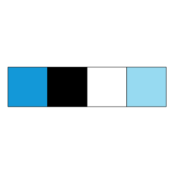
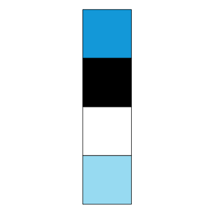
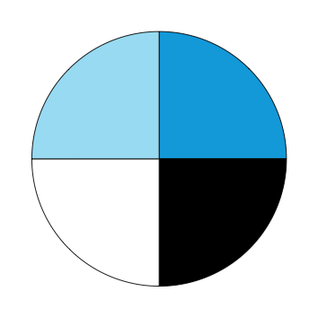


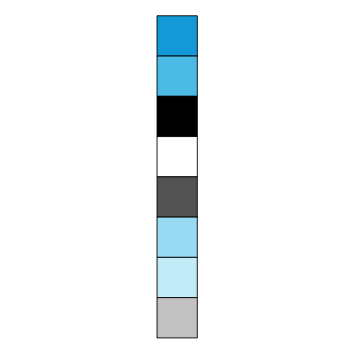
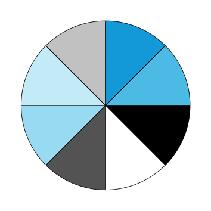


### Pi tiles

Add the 1st `N` digits of pi as data to `tb`:

```{r, echo = FALSE}
# Data: ------ 

tb # from above

N <- nrow(tb)  # N of digits
N

## pi data: 
# pi_all <- numeric()
# pi_all <- readLines("http://www.apup.org/images/digits100000.txt")        
# orig. data source http://www.geom.uiuc.edu/~huberty/math5337/groupe/digits.html
pi_max <- readLines("./../data/_pi/pi_100k.txt")  # my version, based on http://www.geom.uiuc.edu/~huberty/math5337/groupe/digits.html
# head(pi_max)  # is a string

## N digits of pi (as text string): 

if (N == 1) {
  
  pi_N_num <- 3  
  
} else if (N == 2) {
  
  pi_N_num <- c(3, 1)
  
} else {  # N > 2:
  
  pi_N_string <- paste0(substr(pi_max, 1, 1), substr(pi_max, 3, (N + 1)))  # skip the "." at position 2!  
  # nchar(pi_N_string)
  
  pi_N_chars <- unlist(strsplit(pi_N_string, split = ""))
  # length(pi_N_chars)
  
  pi_N_num <- as.numeric(pi_N_chars)
  
}

# First N digits of pi:
length(pi_N_num) == N
head(pi_N_num)

## Arrange tb by sort:
tb <- tb %>% 
  select(sort, rand, x, y, everything()) %>%
  arrange(sort, x, y)
tb

## Add new variables to tb:
tb$pi_sort <- NA
tb$pi_sort <- pi_N_num

tb$pi_rand <- NA
tb$pi_rand <- tb$pi_sort[tb$rand]

# Color of label: 
tb$col_pi <- "black"  # "black" as default
tb$col_pi[tb$pi_sort == 1 | tb$pi_sort == 2] <- "white"  # "white" values of 1 or 2

## Result:
tb
```

Colors:

```{r, echo = FALSE}
## Re-initialize colors, based on pal_unikn:

# pal_unikn

unikn_sort <- pal_unikn     
unikn_pi <- rev(pal_unikn)  # 10 colors: black > white > Seeblau

# unikn_pi
```

Graphical version: 

The first `r N` digits of `r expression(pi)` mapped to uni.kn color scale:

- 0 is white
- 1 is black
- 2 is dark grey
- 3 is Seeblau

```{r pi_tile_plots_brd_lbl, fig.width = 6, fig.height = 6}
# Parameters:
cur_lbl <- expression(pi)
lbl_size <- 2
x_lbl <- 1 
y_lbl <- (n_y + 1) + n_y/15

# Tile plots: ------ 

# tb  # data

# (4a) sorted version (WITH border lines AND label):
pi_tile_sort_lbl <- ggplot(tb) +
  geom_tile(aes(x = x, y = y, fill = pi_sort), col = brd_col, size = brd_size) +
  geom_text(aes(x = x, y = y, label = pi_sort), col = "black", size = lbl_size) +  # pi values as tile labels 
  scale_y_continuous(limits = c(0, y_lbl)) + 
  # scale_x_continuous(limits = c(0, n_x + 1)) + 
  coord_fixed() + 
  # labs(title = "ds4psy") + 
  ## Color schemes: 
  # scale_fill_continuous(low = Seeblau, high = grey(1, 1)) +   # light: Seeblau > white
  # scale_fill_gradientn(colors = unikn_sort) +               # full unikn_sort palette: Seeblau > white > black
  # scale_fill_gradientn(colors = c(unikn_sort, "gold")) +    # highlight final row
  # scale_fill_gradientn(colors = c(unikn_sort, "gold")) +    # highlight final row
  scale_fill_gradientn(colors = unikn_pi) +
  ds_theme
pi_tile_sort_lbl
```

### Combine multiple plots

```{r combine_plots, eval = FALSE, fig.width = 4, fig.height = 2}
plot_grid(tile_rand, tile_sort)

plot_grid(pole_rand, pole_sort)

plot_grid(tile_rand, pole_sort)
```


## Waves

Data:

```{r}
N <- 100000

df <- tibble(x = 1:N,
             a = rnorm(n = N, mean =   0, sd = 250),
             # b = rnorm(n = N, mean = 100, sd = 200), 
             c = rnorm(n = N, mean = 500, sd = 200)
)
# df
```

Density plots:

```{r waves_1, eval = FALSE, fig.width = 5, fig.height = 1}
lwd_all <- 3

ggplot(df) +
  geom_density(aes(x = a), col = Seeblau, fill = "black", lwd = lwd_all, alpha = .25) +
  # geom_density(aes(x = b), col = "black", fill = unikn.pal[[5]], alpha = .33) + 
  geom_density(aes(x = c), col = "black", fill = Seeblau, lwd = lwd_all, alpha = .33) +
  theme_void()
```

Histograms (with function curves):

```{r waves_2, fig.width = 8, fig.height = 4}
lwd_all <- .75

# overlay histogram and normal density
ggplot(df) +
  geom_histogram(aes(x = c, y = stat(density)), binwidth = 150, col = "white", fill = "black", alpha = .25) +
  geom_histogram(aes(x = a, y = stat(density)), binwidth = 150, col = "white", fill = Seeblau, alpha = .25) +
  stat_function(fun = dnorm, args = list(mean = mean(df$c), sd = sd(df$c)), lwd = lwd_all, col = "black", alpha = .95) + 
  stat_function(fun = dnorm, args = list(mean = mean(df$a), sd = sd(df$a)), lwd = lwd_all, col = Seeblau, alpha = .95) + 
  scale_x_continuous(limits = c(-2000, 1400)) +
  theme_void() # +
  # annotate(geom = "text", x = -1900, y = .0018, label = course_title, color = "black", alpha = .90, adj = 0, fontface = 2, size = 2.5)

ggsave("./../images/wave/hist_wave_2.png", width = 16, height = 8, units = c("cm"), dpi = 300)
```

Waves (as curves):

```{r waves_3, fig.width = 8, fig.height = 1}
# as curves: 
lwd_all <- .75

ggplot(df) +
  stat_function(fun = dnorm, args = list(mean = 300, sd = 275), lwd = lwd_all, col = "black", alpha = .99) + 
  stat_function(fun = dnorm, args = list(mean =   0, sd = 300), lwd = lwd_all, col = Seeblau, alpha = .40) + 
  stat_function(fun = dnorm, args = list(mean = 600, sd = 250), lwd = lwd_all, col = "black", alpha = .40) +
  stat_function(fun = dnorm, args = list(mean = 900, sd = 225), lwd = lwd_all, col = Seeblau, alpha = .75) +
  scale_x_continuous(limits = c(-4000, 1700)) +
  theme_void() # +
  # annotate(geom = "text", x = -3900, y = .0016, label = course_title, color = "black", alpha = .90, adj = 0, fontface = 2, size = 2.5)

ggsave("./../images/wave/waves_4.png", width = 15, height = 1.5, units = c("cm"), dpi = 300)
```


## ToC art 

### ToC bar chart

ToC (chronology and relevance of sessions) as bar charts:

```{r plot_toc_data, fig.width = 8, fig.height = 8}
# N <- 10  # number of chapters/topics
# nr <- 1:N
# tp <- c("Introduction", "Chapter 2", "Chapter 3", "Chapter 4", "Chapter 5", 
#         "Chapter 6", "Chapter 7", "Chapter 8", "Chapter 9", "Chapter 10")
# val <- 10 + nr

# Table of contents (ToC):
toc <- tribble(
  ~nr, ~tp,                 ~ctr,  ~part,   
  0,  "Introduction",          2,  0,
  1, 	"R basics",              10, 0, # was: "Basic R concepts and commands",
  2, 	"Visualizing data",      8,  1, 
  3, 	"Transforming data",     9,  1, 
  4, 	"Exploring data",       10,  1, # was: "Exploring data (EDA)"
  5, 	"Tibbles",               7,  2, 
  6, 	"Importing data",        5,  2,  
  7, 	"Tidying data",          9,  2,  
  8, 	"Joining data",          8,  2,  
  9, 	"Functions",             9,  3, 
 10,  "Iteration",             7,  3)

toc <- toc %>% mutate(nr_val = nr + 10) # add constant to increase overall height of bars

# Parameters:
N <- nrow(toc)
max_nr_val <- max(toc$nr_val)
min_ctr <- min(toc$ctr)
max_ctr <- max(toc$ctr)
tol <- 2  # tolerance value (for text labels)
txt_size <- 2.5  # size of txt labels (below)

## Colors: ------ 

library(unikn)

# unikn.pal  # basic 

# unikn_toc:  # 11 colors
unikn_toc <- seecol(pal = c(Grau, Bordeaux, pal_seeblau[c(4,3,5,3,1,4,2)], pal_seegruen[c(3,5)]), n = 11)

seeblau_10 <- seecol(pal = pal_seeblau, n = 10)
unikn_toc <- seecol(pal = c("white", seeblau_10))

# Colors of parts: 

# Use some distinct base-R colors: 
part_col <- c("steelblue", "firebrick", "orange", "forestgreen")  

# Use unikn colors:
# seecol(pal = c(pal_peach[4], pal_bordeaux[4], pal_seegruen[3], pal_petrol[4]))
part_col <- usecol(pal = c(pal_peach[4], pal_bordeaux[4], pal_seegruen[3], pal_petrol[4]))

# mixing unikn with a shade of "orange":
# seecol(pal = c(pal_seegruen[3], pal_bordeaux[4], "orange2", pal_petrol[4]))
part_col <- usecol(pal = c(pal_seegruen[3], pal_bordeaux[4], "orange2", pal_petrol[4]))

part_col <- unname(part_col)
# part_col
```

Bar plots: 

```{r plot_toc_bar, fig.width = 8, fig.height = 6}
## Bar plots: ------ 

# (a) Chronology:

bar_hori <- ggplot(toc, aes(x = nr)) +
  geom_bar(aes(y = ctr, fill = nr_val), stat = "identity", color = grey(.2, 1), size = .2) +
  scale_fill_gradientn(colors = unikn_toc) +
  geom_text(aes(y = ctr + .25, label = tp), angle = 0, adj = 0, size = txt_size) + 
  scale_x_reverse(breaks = 0:N, labels = 0:N) + 
  # scale_x_continuous(breaks = 0:N, labels = 0:N) + 
  scale_y_continuous(limits = c(0, (max_ctr + tol)), breaks = 1:max_ctr, labels = 1:max_ctr) + 
  theme_minimal() + 
  theme(legend.position = "none", panel.grid.minor = element_blank(), panel.grid.major.x = element_blank()) +
  coord_flip() + 
  labs(title = "ds4psy: Chronology of sessions", x = "Session", y = "Relevance")
bar_hori

# Save plot:
cur_name <- paste0(pic_path, "/toc/", "toc_chronology", ".png")
ggsave(cur_name, width = 15, height = 10, units = c("cm"), dpi = 300)

# (b) Relevance:

bar_vert <- ggplot(toc, aes(x = nr)) +
  geom_bar(aes(y = ctr, fill = ctr), stat = "identity", color = grey(.2, 1), size = .2) +
  scale_fill_gradientn(colors = unikn_toc) +
  # scale_fill_gradient(low = "white", high = pal_seeblau[[5]], limits = c(min_ctr, max_ctr)) +
  geom_text(aes(y = ctr + .5, label = tp), angle = 90, adj = 0, size = txt_size) + 
  scale_x_continuous(breaks = 0:N, labels = 0:N) + 
  scale_y_continuous(limits = c(0, (max_ctr + tol)), breaks = 1:max_ctr, labels = 1:max_ctr) + 
  theme_minimal() + 
  theme(legend.position = "none", panel.grid.minor = element_blank()) +
  labs(title = "ds4psy: Relevance of topics", x = "Session", y = "Relevance")
bar_vert

## Save plot:
# WAS: cur_name <- paste0(pic_path, "/toc/", "toc_relevance", ".png")
cur_name <- here("images", "toc", "toc_relevance.png")
ggsave(cur_name, width = 15, height = 10, units = c("cm"), dpi = 300)
```

Vertical bar plot (showing relevance by session) with parts [added on 2019-05-11]:

```{r plot_toc_bar_part, fig.width = 8, fig.height = 6}

# (a) Vertical bar plot (with parts as lines): 
bar_vert_part <- ggplot(toc, aes(x = nr)) +
  geom_line(aes(x = nr, y = -.5, color = factor(part)), size = 2.5, alpha = .88) +  # NEW: to mark parts 
  scale_color_manual(values = part_col) + 
  geom_bar(aes(y = ctr, fill = ctr), stat = "identity", color = grey(.2, 1), size = .2) +
  scale_fill_gradientn(colors = unikn_toc) +
  # scale_fill_gradient(low = "white", high = pal_seeblau[[5]], limits = c(min_ctr, max_ctr)) +
  geom_text(aes(y = ctr + .3, label = tp), angle = 90, adj = 0, size = txt_size) + 
  scale_x_continuous(breaks = 0:N, labels = 0:N) + 
  scale_y_continuous(limits = c(-1, (max_ctr + tol)), breaks = 1:max_ctr, labels = 1:max_ctr) + 
  theme_minimal() + 
  theme(legend.position = "none", panel.grid.minor = element_blank()) +
  labs(title = "ds4psy: Relevance of topics", x = "Session", y = "Relevance")
bar_vert_part 

# (b) Add rectangles (for parts):
y_min <- -.8
y_max <- -.2
bar_vert_part <- bar_vert_part + 
  geom_rect(aes(xmin = -.45, xmax =  1.45, ymin = y_min, ymax = y_max), color = part_col[1], fill = "white", alpha = .50) +
  geom_rect(aes(xmin = 1.55, xmax =  4.45, ymin = y_min, ymax = y_max), color = part_col[2], fill = "white", alpha = .50) +
  geom_rect(aes(xmin = 4.55, xmax =  8.45, ymin = y_min, ymax = y_max), color = part_col[3], fill = "white", alpha = .50) +
  geom_rect(aes(xmin = 8.55, xmax = 10.45, ymin = y_min, ymax = y_max), color = part_col[4], fill = "white", alpha = .50)

# (c) Add text annotations (for parts):
y_lbl <- -.475
s_txt <- 2.8

bar_vert_part + 
  annotate("text", x = 0.5, y = y_lbl, label = "Prepare", size = s_txt) + 
  annotate("text", x = 3.0, y = y_lbl, label = "Explore", size = s_txt) + 
  annotate("text", x = 6.5, y = y_lbl, label = "Wrangle", size = s_txt) + 
  annotate("text", x = 9.5, y = y_lbl, label = "Program", size = s_txt)

## Save plot:
# WAS: cur_name <- paste0(pic_path, "/toc/", "toc_relevance", ".png")
cur_name <- here("images", "toc", "toc_relevance_part.png")
ggsave(cur_name, width = 15, height = 12.5, units = c("cm"), dpi = 300)
```


### ToC polar charts

ToC and current session as a clock chart (bar chart with polar coordinates):

```{r plot_toc_polar, fig.width = 8, fig.height = 8}
# (2) Plots on polar coordinates:

tol <- 4  # tolerance value (for text labels)

## (A) Chronology (as clock):

topic_clock <- ggplot(toc, aes(x = nr)) +
  geom_bar(aes(y = ctr, fill = nr_val), stat = "identity", color = grey(0, 1), size = .25) +
  scale_fill_gradientn(colors = unikn_toc) +
  # scale_fill_gradient(low = "white", high = Seeblau, limits = c(min_ctr, max_ctr)) +
  geom_text(aes(y = max_ctr + tol/2, label = tp), adj = .5, size = txt_size) + 
  scale_x_continuous(breaks = 0:N, labels = 0:N) + 
  scale_y_continuous(limits = c(0, (max_ctr + tol)), breaks = 1:max_ctr, labels = 1:max_ctr) + 
  coord_polar() + 
  # labs(title = "Centrality of topic", x = "Chapter", y = "Topic") + 
  # theme_void() + 
  theme_light() + 
  theme(legend.position = "none", axis.line = element_blank(), 
        axis.title = element_blank(), axis.text.y = element_blank(),
        axis.ticks = element_blank(), panel.border = element_blank())
# topic_clock

## (B) Centrality of topic (as clock):

centrality <- ggplot(toc, aes(x = nr)) +
  geom_bar(aes(y = ctr, fill = ctr), stat = "identity", color = grey(.10, 1), size = .25) +
  # scale_fill_gradientn(colors = unikn_toc) +
  scale_fill_gradient(low = "white", high = pal_seeblau[[5]], limits = c(min_ctr, max_ctr)) +
  geom_text(aes(y = (max_ctr + .65 * tol), label = tp), adj = .5, size = txt_size) + 
  scale_x_continuous(breaks = 0:N, labels = 0:N) + 
  scale_y_continuous(limits = c(0, (max_ctr + tol)), breaks = 1:max_ctr, labels = 1:max_ctr) + 
  coord_polar() + 
  # theme_void() + 
  theme_light() + 
  theme(#legend.position = "none", 
        axis.line = element_blank(), 
        axis.title = element_blank(), axis.text.y = element_blank(),
        axis.ticks = element_blank(), panel.border = element_blank()) +
  labs(fill = "Relevance:") 
centrality

## Save plot:
# WAS: cur_name <- paste0(pic_path, "/toc/", "toc_centrality", ".png")
cur_name <- here("images", "toc", "toc_centrality.png")
ggsave(cur_name, width = 15, height = 15, units = c("cm"), dpi = 300)
```

**Related ideas:** 

- Add an outer ring with global structure:
    - Basics (0--1)
    - EDA (2--4)
    - Data tables (5--8)
    - Programming (9--10)

- Re-sort topics (e.g., move sessions on tibbles and importing data forward)


### Current session clock

Highlight the current session `session_val` in the polar chart: 

```{r plot_toc_clock, fig.width = 8, fig.height = 8}
# (C) Highlight the current session (in gold):

# session number:
n_rand <- sample(0:11, size = 1, replace = TRUE)  # random integer (0:11)
nr_session <- n_rand  # random session nr (as in polar clock plot above)
# nr_session <- 11      # specific session nr

tol <- 8         # increase tolerance value (to leave more space for text labels)
txt_size <- 2.0  # decrease (to keep topic labels within highlighted areas)
  
# Add current session_val to toc:
toc$session_val <- 0  # initialize session_val to 0 
toc$session_val[(nr_session + 1)] <- (max_ctr + tol)  # maximum y-value
# toc

cur_session_clock <- ggplot(toc, aes(x = nr)) + 
  geom_bar(aes(y = session_val), stat = "identity", fill = "gold", alpha = .67) +
  geom_bar(aes(y = ctr, fill = ctr), stat = "identity", color = grey(.10, 1), size = .25) +
  # scale_fill_gradientn(colors = unikn_toc) +
  scale_fill_gradient(low = "white", high = pal_seeblau[[5]], limits = c(min_ctr, max_ctr)) +
  scale_color_manual(values = part_col) + 
  geom_text(aes(y = (max_ctr + .45 * tol), label = tp), adj = .5, size = txt_size, fontface = 1) +    # topic labels
  scale_x_continuous(breaks = 0:N, labels = 0:N) + 
  scale_y_continuous(limits = c(0, (max_ctr + tol)), breaks = 1:max_ctr, labels = 1:max_ctr) + 
  coord_polar() + 
  # theme_void() + 
  theme_light() + 
  theme(legend.position = "none", 
        axis.line = element_blank(), 
        axis.title = element_blank(), axis.text.y = element_blank(),
        axis.ticks = element_blank(), panel.border = element_blank()) +
  labs(fill = "Centrality:") 
cur_session_clock

# Save plot:
cur_name <- paste0(pic_path, "/toc/", "toc_clock_", nr_session, ".png")
ggsave(cur_name, width = 10, height = 10, units = c("cm"), dpi = 300)
```

Session clock with colored parts [last modified on 2019-05-14]:

```{r plot_toc_clock_parts, fig.width = 8, fig.height = 8}
max_y_val <- (max_ctr + tol)

# (a) Polar bar plot (with parts as lines): 
cur_session_clock_parts <- ggplot(toc, aes(x = nr)) +
  geom_line(aes(y = 18.5, color = factor(part)), size = 2.5, alpha = .88) +  # NEW: to mark parts 
  geom_bar(aes(y = session_val), stat = "identity", fill = "gold", alpha = .67) +
  geom_bar(aes(y = ctr, fill = ctr), stat = "identity", color = grey(.10, 1), size = .25) +
  # scale_fill_gradientn(colors = unikn_toc) +
  scale_fill_gradient(low = "white", high = pal_seeblau[[5]], limits = c(min_ctr, max_ctr)) +
  scale_color_manual(values = part_col) + 
  geom_text(aes(y = (max_ctr + .44 * tol), label = tp), adj = .5, size = txt_size, fontface = 1) +    # topic labels
  scale_x_continuous(breaks = 0:N, labels = 0:N) + 
  scale_y_continuous(limits = c(0, (max_ctr + tol + 3)), breaks = 1:max_ctr, labels = 1:max_ctr) + 
  coord_polar() + 
  # theme_void() + 
  theme_light() + 
  theme(legend.position = "none", 
        axis.line = element_blank(), 
        axis.title = element_blank(), axis.text.y = element_blank(),
        axis.ticks = element_blank(), panel.border = element_blank()) +
  labs(fill = "Centrality:") 
cur_session_clock_parts

# # (b) Add rectangles (for parts):
# y_min <- 18
# y_max <- 19
# cur_session_clock_parts <- cur_session_clock_parts + 
#   geom_rect(aes(xmin = -.40, xmax =  1.45, ymin = y_min, ymax = y_max), color = part_col[1], fill = "white", alpha = .50) +
#   geom_rect(aes(xmin = 1.55, xmax =  4.45, ymin = y_min, ymax = y_max), color = part_col[2], fill = "white", alpha = .50) +
#   geom_rect(aes(xmin = 4.55, xmax =  8.45, ymin = y_min, ymax = y_max), color = part_col[3], fill = "white", alpha = .50) +
#   geom_rect(aes(xmin = 8.55, xmax = 10.40, ymin = y_min, ymax = y_max), color = part_col[4], fill = "white", alpha = .50)
# cur_session_clock_parts

# (c) Add text annotations (for parts):
y_lbl <- 20.9
s_txt <- 2.0

cur_session_clock_parts + 
  annotate("text", x = 0.5, y = y_lbl, label = "Prepare", size = s_txt) + # , color = part_col[1]) + 
  annotate("text", x = 3.5, y = y_lbl, label = "Explore", size = s_txt) + # , color = part_col[2]) + 
  annotate("text", x = 6.5, y = y_lbl, label = "Wrangle", size = s_txt) + # , color = part_col[3]) +  
  annotate("text", x = 9.5, y = y_lbl, label = "Program", size = s_txt)   # , color = part_col[4]) 

# Save plot:
cur_name <- paste0(pic_path, "/toc/", "toc_clock_part_", nr_session, ".png")
ggsave(cur_name, width = 10, height = 10, units = c("cm"), dpi = 300)
```


# Miscellaneous R art

See <https://www.r-graph-gallery.com/portfolio/data-art/> (and links below) for many more examples. 

## Matrix

```{r}
# plotting parameters: 
opar <- par(no.readonly = TRUE)  # all par settings that can be changed.
```

Original version: 

```{r matrix_original, eval = FALSE}
# Source: http://www.r-graph-gallery.com/56-matrix-abstract-painting/

# generate pairs of x-y values
nx = 100
ny = 80
x = sample(x = 1:nx, size = 90, replace = TRUE)
y = seq(-1, -ny, length = 90)
 
# set graphical parameters: 
op = par(bg = "black", mar = c(0, 0.2, 0, 0.2))
 
# plot: 
plot(1:nx, seq(-1, -nx), type = "n", xlim = c(1, nx), ylim = c(-ny+10, 1))
for (i in seq_along(x))
{
  aux = sample(1:ny, 1)
  points(rep(x[i], aux), y[1:aux], pch = sample(letters, aux, replace = TRUE), 
         col = hsv(0.35, 1, 1, runif(aux, 0.3)), cex = runif(aux, 0.3))
}
 
# signature: 
legend("bottomright", legend = "© Gaston Sanchez", bty = "n", text.col = "gray70")
```

Adpated version: 

```{r matrix_adapted, eval = FALSE, fig.width = 6, fig.height = 6}
# Source: http://www.r-graph-gallery.com/56-matrix-abstract-painting/
	
# generate pairs of x-y values
nx <- 100
ny <-  80

x <- sample(x = 1:nx, size = (nx - 10), replace = TRUE)
y <- seq(-1, -ny, length = (nx - 10))

# plotting parameters: 
col_bg <- "black" # white" # "black"
col_mx <- pal_seeblau[[5]] # Seeblau

op <- par(bg = col_bg, mar = c(0, 0, 0, 0))

seeblau_rgb <- col2rgb(col_mx)
seeblau_hsv <- rgb2hsv(seeblau_rgb)
unikn_sample <- c("d", "s", "ds", "4", "p", "s", "y",  
                  "2", "0", "1", "9", "19")

# Create empty plot:
plot(1:nx, seq(-1, -nx), type = "n", xlim = c(1, nx), ylim = c(-ny + 10/2, 1))

# Loop:
for (i in seq_along(x))
{
  aux = sample(1:ny, 1)
  points(rep(x[i], aux), y[1:aux], pch = sample(unikn_sample, aux, replace = TRUE), 
         col = hsv(seeblau_hsv[[1]], 1, 1, alpha = runif(aux, 0.3)), cex = runif(aux, 0.3))
}

## Save plot manually (not a ggplot object)! 

## Clean up: 
par(opar)  # restore original plot settings
```

## Rings

Original version:

```{r rings_original, eval = FALSE, fig.width = 6, fig.height = 6}
# Source: http://www.r-graph-gallery.com/58-saturn-rings-abstract-painting/
	
# generate pairs of x-y values
x = seq(-50, 50, by = 1)
y = -(x^2)
 
# set graphic parameters
op = par(bg = 'black', mar = rep(0.5, 4))
 
# Plot 
plot(y, x, type = 'n')
lines(y, x, lwd = 2*runif(1), col = hsv(0.08, 1, 1, alpha = runif(1, 0.5, 0.9)))
for (i in seq(10, 2500, 10))
{
  lines(y-i, x, lwd = 2*runif(1), col = hsv(0.08, 1, 1, alpha = runif(1, 0.5, 0.9)))
}
for (i in seq(500, 600, 10))
{
  lines(y - i, x, lwd = 2*runif(1), col = hsv(0, 1, 1, alpha = runif(1, 0.5, 0.9)))
}
for (i in seq(2000, 2300, 10))
{
  lines(y - i, x, lwd = 2*runif(1), col = hsv(0, 1, 1, alpha = runif(1, 0.5, 0.9)))
}
for (i in seq(100, 150, 10))
{
  lines(y - i, x, lwd = 2*runif(1), col = hsv(0, 1, 1, alpha = runif(1, 0.5, 0.9)))
}
 
# signature
legend("bottomright", legend="© Gaston Sanchez", bty = "n", text.col="gray70")
```

Adapted version:

```{r rings_adapted, eval = FALSE, fig.width = 4, fig.height = 4}
# Adapted from: http://www.r-graph-gallery.com/58-saturn-rings-abstract-painting/
	
# generate pairs of x-y values:
x = seq(-50, 50, by = 1)
y = -(x^2)
 
# set graphic parameters:
op = par(bg = "black", mar = rep(.5, 4))
# op = par(bg = "white", mar = rep(.5, 4))

original_h <- .08  # original hue value
# Seeblau versions:
seeblau_rgb <- col2rgb(Seeblau)
seeblau_hsv <- rgb2hsv(seeblau_rgb)
seeblau_hsv 
#  Seeblau
# h 0.5409226
# s 1.0000000
# v 0.8784314

seeblau_h <- seeblau_hsv[[1]]

white_rgb <- col2rgb("white")
white_hsv <- rgb2hsv(white_rgb)
white_hsv  # 0 0 1

grey_rgb <- col2rgb("grey")
grey_hsv <- rgb2hsv(grey_rgb)
grey_hsv  # 0 0 0.75

# Plot: 
plot(y, x, type = 'n')

# one: 
lines(y, x, lwd = 2 * runif(1), col = hsv(seeblau_h, 1, 1, alpha = runif(1, .5, .9)))

# all: 
for (i in seq(10, 2500, 10)) {
  lines(y-i, x, lwd = 2 * runif(1), col = hsv(seeblau_h, 1, 1, alpha = runif(1, .5, .9)))
}

# inner: 
for (i in seq(500, 600, 10)) {
  lines(y - i, x, lwd = 2 * runif(1), col = hsv(0, 0, .75, alpha = runif(1, .5, .9)))
}

# middle:
for (i in seq(2000, 2300, 10)) {
  lines(y - i, x, lwd = 2 * runif(1), col = hsv(0, 0, .75, alpha = runif(1, .5, .9)))
}

# outer:
for (i in seq(100, 150, 10)){
  lines(y - i, x, lwd = 2 * runif(1), col = hsv(0, 0, .75, alpha = runif(1, .5, .9)))
}

## Save plot manually (as not a ggplot object)! 

## Clean up: 
par(opar)  # restore original plot settings
```

## Grasslands

Original version:

```{r grasslands_original, eval = FALSE, fig.width = 8, fig.height = 6}
# Source: https://www.r-graph-gallery.com/138-green-world-data-art/

library(ggplot2)
library(RColorBrewer)

set.seed(92)
ngroup=20
names=paste("G_",seq(1,ngroup),sep="")
DAT=data.frame()

for(i in seq(1:50)){
    data=data.frame( matrix(0, ngroup , 3))
    data[,1]=i
    data[,2]=sample(names, nrow(data))
    data[,3]=prop.table(sample( c(rep(0, 100), c(1:ngroup)), nrow(data)))
    DAT=rbind(DAT,data)
    }

colnames(DAT) = c("Year","Group","Value")
DAT = DAT[order(DAT$Year, DAT$Group), ]

ggplot(DAT, aes(x=Year, y=Value, fill=Group )) + 
    geom_area(alpha=1 , color="transparent" )+
    theme_bw() +
    scale_fill_brewer(palette="Greens", breaks=rev(levels(DAT$Group)))+
     theme(line = element_blank(),
        text = element_blank(),
        title = element_blank(),
        legend.position = "none",
        panel.border = element_blank(),
        panel.background = element_blank())
```

Adapted version:

```{r grasslands_modified, eval = FALSE, fig.width = 8, fig.height = 6}
# Adapted from: https://www.r-graph-gallery.com/138-green-world-data-art/

library(ggplot2)
library(RColorBrewer)

set.seed(101)

ngroup <- 20
names <- paste("G_", seq(1, ngroup), sep = "")
DAT <- data.frame()

# Color palette: 
seeblau_pal <- sample(unikn.pal, size = ngroup, replace = TRUE)
seeblau_pal <- rep(c(unikn.pal[1], unikn.pal[2], unikn.pal[3], unikn.pal[4], unikn.pal[5]), 4)

for(i in seq(1:50)){
    data = data.frame( matrix(0, ngroup , 3))
    data[ , 1] = i
    data[ , 2] = sample(names, nrow(data))
    data[ , 3] = prop.table(sample( c(rep(0, 100), c(1:ngroup)), nrow(data)))
    DAT = rbind(DAT, data)
    }

colnames(DAT) <- c("x", "group", "value")
DAT <- DAT[order(DAT$x, DAT$group), ]

dim(DAT)

ggplot(DAT, aes(x = x, y = value, fill = group)) + 
  geom_area(alpha = 1, color = "transparent") +
  theme_bw() +
  scale_fill_brewer(palette = "Blues", breaks = rev(levels(DAT$group))) +
  theme(line = element_blank(),
        text = element_blank(),
        title = element_blank(),
        legend.position = "none",
        panel.border = element_blank(),
        panel.background = element_blank()
  )

## Save plot:
# cur_name <- paste0(pic_path, "/art_grass", ".png")
# ggsave(cur_name, width = 15, height = 10, units = c("cm"), dpi = 300)
```

## Harmonographs

Original version:

```{r harmonographs_original, eval = FALSE, fig.width = 8, fig.height = 6}
# Source: https://fronkonstin.com/2014/10/13/beautiful-curves-the-harmonograph/ 

f1 = jitter(sample(c(2,3),1)); f2 = jitter(sample(c(2,3),1)); f3 = jitter(sample(c(2,3),1)); f4 = jitter(sample(c(2,3),1))

d1 = runif(1,0,1e-02); d2=runif(1,0,1e-02); d3=runif(1,0,1e-02); d4=runif(1,0,1e-02)
p1 = runif(1,0,pi); p2=runif(1,0,pi); p3=runif(1,0,pi); p4=runif(1,0,pi)
xt = function(t) exp(-d1*t)*sin(t*f1+p1)+exp(-d2*t)*sin(t*f2+p2)
yt = function(t) exp(-d3*t)*sin(t*f3+p3)+exp(-d4*t)*sin(t*f4+p4)
t=seq(1, 100, by=.001)
dat = data.frame(t=t, x=xt(t), y=yt(t))
with(dat, plot(x, y, type="l", xlim =c(-2,2), ylim =c(-2,2), xlab = "", ylab = "", xaxt='n', yaxt='n'))
```

Adapted version:

```{r harmonographs_adapted, eval = FALSE, fig.width = 3, fig.height = 3}
# Adapted from: https://fronkonstin.com/2014/10/13/beautiful-curves-the-harmonograph/ 

seed <- 202
set.seed(seed)

f1 = jitter(sample(c(2, 3), 1))  
f2 = jitter(sample(c(2, 3), 1))  
f3 = jitter(sample(c(2, 3), 1))  
f4 = jitter(sample(c(2, 3), 1))

d1 = runif(1, 0, 1e-02)  
d2 = runif(1, 0, 1e-02)  
d3 = runif(1, 0, 1e-02)  
d4 = runif(1, 0, 1e-02)

p1 = runif(1, 0, pi)  
p2 = runif(1, 0, pi)  
p3 = runif(1, 0, pi)  
p4 = runif(1, 0, pi)

t = seq(1, 100, by = .001)

xt = function(t) exp(-d1 * t) * sin(t * f1 + p1) + 
                 exp(-d2 * t) * sin(t * f2 + p2)

yt = function(t) exp(-d3 * t) * sin(t * f3 + p3) + 
                 exp(-d4 * t) * sin(t * f4 + p4)

df = data.frame(t = t, x = xt(t), y = yt(t))
df

## Plot: ------ 

with(df, plot(x, y, type = "l", 
              col = Seeblau,  
              xlim = c(-2, 2), ylim = c(-2, 2), 
              xlab = "", ylab = "", 
              xaxt = 'n', yaxt = 'n'))

## Add text label: ------ 

add_label <- TRUE

if (add_label) {
  cur_lbl <- "Session X: Title of current topic"
  
  x_pos <- -2.12  # min(df$x)
  y_pos <-  2.33  # max(df$y)
  
  text(x = x_pos, y = y_pos, labels = cur_lbl, col = grey(.33, 1), adj = 0, font = 1, 
       xpd = TRUE  # FALSE = plot region; TRUE = figure region; NA = device region.
       )
}
```

**Related ideas:**

- Always combine 2 similar shapes: 
    - wirr: perceptually random version 
    - klar: seemingly systematic version 
- Remove frame (or make a square)
- Consider adding chapter numbers and titles?


## Circles

Based on geometric data art from <https://www.r-graph-gallery.com/186-marcus-volz-dataart/>:

```{r geom_data_org, eval = FALSE}
# Source: https://www.r-graph-gallery.com/186-marcus-volz-dataart/ 

library(dplyr)
library(ggplot2)
library(ggthemes)
 
n <- 20000
a <- 0.5
 
set.seed(101)
 
make_circle <- function(tx, ty) {
data <- data.frame(angle = runif(n, 0, 2 * pi)) %>%
mutate(x = a * cos(angle) + tx, y = a * sin(angle) + ty) %>%
select(x, y)
data2 <- data[sample(nrow(data)),]
data <- bind_cols(data, data2)
names(data) <- c("x1", "y1", "x2", "y2")
data
}
 
data <- rbind(make_circle(cos(0), sin(0)),
make_circle(cos(pi/4), sin(pi/4)),
make_circle(cos(pi/2), sin(pi/2)),
make_circle(cos(3*pi/4), sin(3*pi/4)),
make_circle(cos(pi), sin(pi)),
make_circle(cos(5*pi/4), sin(5*pi/4)),
make_circle(cos(3*pi/2), sin(3*pi/2)),
make_circle(cos(7*pi/4), sin(7*pi/4)))
 
ggplot() +
geom_segment(aes(x = x1, xend = x2, y = y1, yend = y2), data %>% filter(x1 != x2),
alpha = 0.15, size = 0.015) +
coord_equal() +
theme_tufte() +
theme(line = element_blank(),
axis.ticks = element_blank(),
axis.ticks.length = unit(0, "null"),
axis.title = element_blank(),
axis.text = element_blank(),
text = element_blank(),
legend.position = "none",
legend.margin=unit(0, "null"),
panel.background = element_blank(),
panel.border=element_blank(),
panel.grid = element_blank(),
panel.margin=unit(c(0,0,0,0), "null"),
plot.background = element_blank(),
plot.margin=unit(c(0,0,0,0), "null"),
strip.text = element_blank())
```

Adapted version:

```{r geom_data_adapted, eval = FALSE}
# Adapted from: https://www.r-graph-gallery.com/186-marcus-volz-dataart/ 

library(dplyr)
library(ggplot2)
library(ggthemes)

data <- NULL
n <- 20000  # Original = 20000 (density/plasticity)
a <- .50    # Original = .50   (angle/distance: <.50 = more space between circles, >.50 = more overlap)

## Note special values:
# a <- 1.0     # flower
# a <- .50     # moderate overlap
# a <- .3825   # just touching circles

set.seed(101)

# Function to make (and mark) circle: 
make_circle <- function(tx, ty, n, val) {
  
  data_1 <- data.frame(angle = runif(n, 0, 2 * pi)) %>%
    mutate(x = a * cos(angle) + tx, 
           y = a * sin(angle) + ty) %>%
    select(x, y)
  
  data_2 <- data_1[sample(nrow(data_1)), ]
  
  data_3 <- data.frame(rep(val, n))  # mark current circle (with nr)
  
  data <- bind_cols(data_1, data_2, data_3)
  names(data) <- c("x1", "y1", "x2", "y2", "val")
  
  data
}

## Create data: ------ 
## for different circles (and mark with val): 
data <- rbind(make_circle(cos(0), sin(0), n, 1),                 # 1:  0 (top)       = 1
              make_circle(cos(1 * pi/4), sin(1 * pi/4), n, 6),   # 2:  8 (top-right) = 2
              make_circle(cos(1 * pi/2), sin(1 * pi/2), n, 3),   # 3: 15 (right)     = 3
              make_circle(cos(3 * pi/4), sin(3 * pi/4), n, 4),   # 4: 52 (top-left)  = 8
              make_circle(cos(1 * pi/1), sin(1 * pi/1), n, 7),   # 5: 45 (left)      = 7
              make_circle(cos(5 * pi/4), sin(5 * pi/4), n, 2),   # 6: 38 (bot-left)  = 6
              make_circle(cos(3 * pi/2), sin(3 * pi/2), n, 5),   # 7: 30 (bot)       = 5
              make_circle(cos(7 * pi/4), sin(7 * pi/4), n, 8)    # 8: 22 (bot-right) = 4
)

# head(data)
# dim(data)

## Filter data (optional?): ----- 
# data <- data %>% filter(x1 != x2)
# dim(data)

## Colors: ------ 
# unikn.pal  # basic color scale
col_light <- unikn.pal[4] # Seeblau 

# col_dark  <- unikn.pal[5] # black 
# col_dark  <- unikn.pal[6] # dark grey
col_dark  <- unikn.pal[7] # mid grey


# Plot: ------ 
ggplot(data) +
  geom_segment(aes(x = x1, xend = x2, y = y1, yend = y2, col = val), # color by val
               alpha = .20, size = .015) +
  scale_color_gradient(low = col_light, high = col_dark) +  # color scale for val 
  coord_equal() +
  theme_nothing()
```

### Note

- perceived plasticity jointly depends on density (`n`), transparency (`alpha`), and color value (`val`). 
- at some resolutions, the color in overlap regions (Seeblau and dark grey) appears to be green!

### Ideas

- choose subsets of the set of 8 complete circles
- vary the number and location of circles
- map circle number `val` to a color scale

### ToDo

- create other objects (squares, triangles, diamonds, etc.)

### Examples

#### 4 circles

Positions and color values can be varied: 


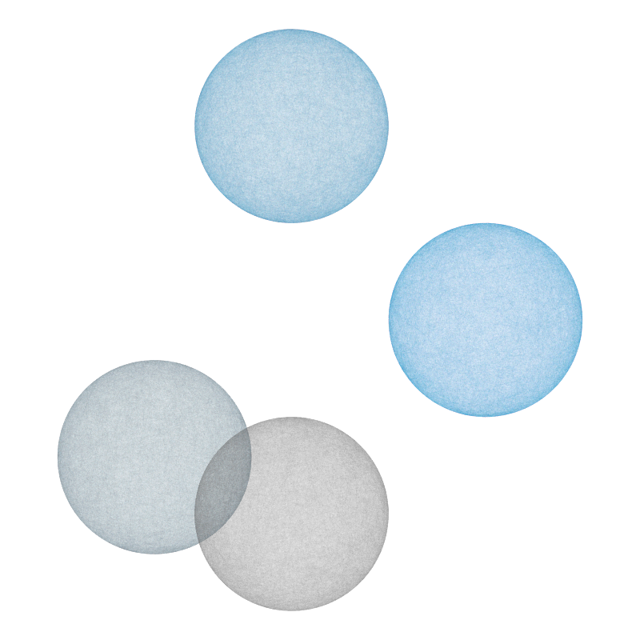


#### 8 circles

Colors can be sorted or mixed up: 


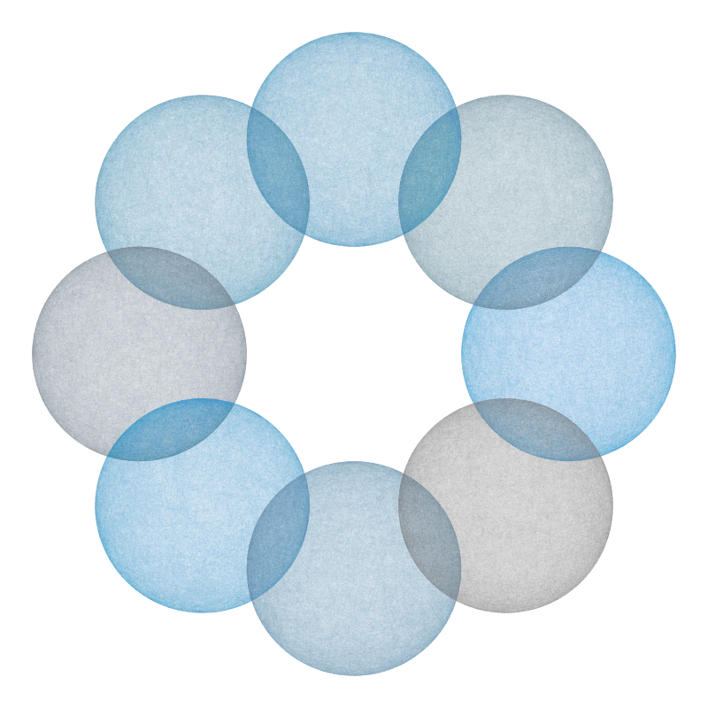


## Tunnel

```{r tunnel_org, eval = FALSE}
# Source: Päivi Julin at <https://www.r-graph-gallery.com/206-paivi-julin/>
library(grid) 
 
dev.new()
pushViewport(viewport(width=1, height=1, angle=0, name="vp1"))
grid.rect()
 
for(i in 1:54){
    pushViewport(viewport(width=0.95, height=0.95, angle=5, name="vp1"))
    grid.rect()
    }
```

## Pi chart

Original version:

```{r pi_org, eval = FALSE}
# Source: Päivi Julin at <https://www.r-graph-gallery.com/206-paivi-julin/>

data<-numeric()
data<-readLines("http://www.apup.org/images/digits100000.txt")        # orig. data source http://www.geom.uiuc.edu/~huberty/math5337/groupe/digits.html

# subset of 10'000 digits
dataA<-numeric()
dataA<-substr(data,1,10000)

# colors
pal <- colorRampPalette(c("#f2f2f2", "blue"))
colors <- pal(10000)

# image settings. here manually set limits (by visual eye).
dev.new(height=7,width=7)
par(bg="black", mar=c(0,0,0,0))
plot(x=0,y=0,xlim=c(-50,70), ylim=c(-100,40))

# initial values
a_x <- a_y <- numeric()
a_x <- 0; a_y <- 0;

# loop decimals. each digit (0-9) represents an individual angle.
for(i in 1:nchar(dataA)){
    a<-b_x<-b_y<-numeric()
    a<-as.numeric(substr(dataA,i,i))

    b_x<-a_x+sin((2*pi/10)*(a))    # orig. y pos. + change    
    b_y<-a_y+cos((2*pi/10)*(a))    # orig. x pos. + change
    
    # draw points. change colors.
    points(x=c(a_x,b_x),y=c(a_y,b_y),type="l", col=colors[i])
    points(x=c(b_x),y=c(b_y),pch=19, col=colors[i],cex=0.3)    
    
    # initialize next round
    a_x<-b_x
    a_y<-b_y
}

text(x=40, y=0, labels=expression(pi), col="#f2f2f2", cex=12, pos=4)    # title
text(x=52, y=10.6, labels="10000", col="black",cex=0.7, pos=4)            # decimal amount
```

Adapted version:

```{r pi_adapted, eval = FALSE, fig.width = 7, fig.height = 7}
# Source: Päivi Julin at <https://www.r-graph-gallery.com/206-paivi-julin/>

# Data: ------ 

N <- 10000  # set N

## pi data: 
# pi_all <- numeric()
# pi_all <- readLines("http://www.apup.org/images/digits100000.txt")        
# orig. data source <http://www.geom.uiuc.edu/~huberty/math5337/groupe/digits.html>
pi_all <- readLines("./data/_pi/pi_100k.txt")  # my version, based on http://www.geom.uiuc.edu/~huberty/math5337/groupe/digits.html
# head(pi_all)  # is a string

## N digits of pi (as text string): 
# pi_N <- numeric()
pi_N <- paste0(substr(pi_all, 1, 1), substr(pi_all, 3, (N + 1)))  # skip the "." at position 2!  

nchar(pi_N)
substr(pi_N, 1, 10)

## Colors: ------ 

# pal <- colorRampPalette(c("#f2f2f2", "blue"))

## Based on: 
unikn.pal
# pal <- colorRampPalette(c("white", Seeblau))  # on black
pal <- colorRampPalette(c(unikn.pal[[4]], grey(.35, 1)))  # on white

pi_col <- pal(N)


# Image settings: ------

# dev.new(height = 7, width = 7)

# par(bg = "black", mar = c(0, 0, 0, 0))
par(bg = "white", mar = rep(.20, 4))

x_min <-  -100
x_max <-   165
y_min <-  -165
y_max <-   100

plot(x = 0, y = 0, type = "n", 
     xlim = c(x_min, x_max), ylim = c(y_min, y_max),
     xlab = "", ylab = "", 
     xaxt = 'n', yaxt = 'n'
     )
     
# initial values:
a_x <- a_y <- numeric()
a_x <- 0 
a_y <- 0

# Loop: each digit (0-9) represents an individual angle: 
for(i in 1:nchar(pi_N)){
  
    # b_x <- b_y
    # a   <- b_x
    a   <- as.numeric(substr(pi_N, i, i))

    scale <- 2.0  # Constant scaling factor. Original: scale <- 1.0  
    
    # Next points: 
    b_x <- a_x + (scale * sin((2 * pi/10) * a))  # orig. y pos. + change    
    b_y <- a_y + (scale * cos((2 * pi/10) * a))  # orig. x pos. + change
    
    # Draw lines, points & change colors:
    points(x = c(a_x, b_x), y = c(a_y, b_y), type = "l", col = pi_col[i])
    points(x = c(b_x), y = c(b_y), pch = 19, col = pi_col[i], cex = 0.3)    
    
    # For next round: 
    a_x <- b_x
    a_y <- b_y
}

## Text label: ------ 
lbl_x <- +80
lbl_y <- -15

# text(x = lbl_x, y = lbl_y, labels = expression(pi), col = grey(.60, 1), cex = 8, pos = 2)  # title
# text(x = (lbl_x + 4), y = (lbl_y - 5), labels = paste0(N), col = grey(.15, 1), cex = .7, pos = 2)  # N of digits

N_k <- round(N/1000, 0)
cur_lbl <- paste0(expression(pi), " to ", N_k, "k digits")
text(x = (x_max - 10), y = y_min, labels = cur_lbl, col = grey(.33, 1), cex = .7, pos = NULL)
```


# Ideas

Various ideas by category (or data type): 

## Word art

- words as maps (see [4L1c3](http://www.apup.org/lab_160313.html))
- crossword puzzles, word search puzzles; 
- visualisations of text identities and similarities
- replacements: [l33t](https://simple.wikipedia.org/wiki/Leet) slang

## Geographic art

- tube lines
- maps with color schemes

## Numeric art

- randomness (e.g., [pi](http://www.apup.org/lab_160314.html)) 

## Organic art

- networks
- webs (e.g., [strange attractors](https://fronkonstin.com/2019/01/10/rcpp-camaron-de-la-isla-and-the-beauty-of-maths/))
- flowers (e.g., <https://fronkonstin.com/>)

## Graphic art 

- paint brush effects


# Links

Some links to inspirations and code sources: 

- Grab bag: R graph gallery at <https://www.r-graph-gallery.com/portfolio/data-art/> 

- Wonderful creations by Antonio Sánchez Chinchón at <https://fronkonstin.com/>: 

    - Strange attractors: [blog](https://fronkonstin.com/2019/01/10/rcpp-camaron-de-la-isla-and-the-beauty-of-maths/) and [github](https://github.com/aschinchon/general-2D-map)

    - Coloring sudokus: [blog](https://fronkonstin.com/2018/06/01/coloring-sudokus/)

    - Phyllotaxis: Draw flowers using mathematics: [DataCamp](https://www.datacamp.com/projects/62); see also Shiny app at <https://stocks.shinyapps.io/phylo/>

- Inspiring pi and text art by Päivi Julin at <http://www.apup.org>

- Artwork by Marcus Volz at <https://marcusvolz.com>


[This file last updated on `r Sys.time()` by [hn](http://neth.de/).]

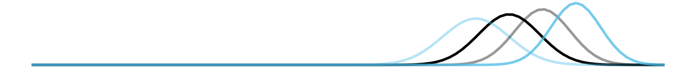

<!-- eof. --> 