```{r preamble, echo = FALSE, eval = TRUE, cache = FALSE, message = FALSE, warning = FALSE}
## (a) Housekeeping: -----
rm(list=ls()) # clean all.

## (b) Current file name and path: ----- 
# cur.path <- dirname(rstudioapi::getActiveDocumentContext()$path)
# cur.path
# setwd(cur.path) # set to current directory
setwd("~/Desktop/stuff/Dropbox/_code/R/_teachR/ds4psy/") # set to current directory
# list.files() # all files + folders in current directory
fileName <- "logo.Rmd"

## (c) Packages: ----- 
library(knitr)
library(rmdformats)
library(tidyverse)
library(cowplot)

## (d) Global options: ----- 
options(max.print = "75")
opts_chunk$set(echo = TRUE,
	             cache = FALSE,
               prompt = FALSE,
               tidy = FALSE,
               collapse = TRUE, # set TRUE in answers 
               comment = "#>",
               message = FALSE,
               warning = FALSE,
               ## Default figure options:
               fig.width = 6, 
               fig.asp = .618, # golden ratio
               out.width = "75%",
               fig.align = "center"
               )
opts_knit$set(width = 75)

## (e) Custom functions: ----- 
source(file = "~/Desktop/stuff/Dropbox/_code/R/_teachR/ds4psy/R/custom_functions.R")

# plotting parameters: 
opar <- par(no.readonly = TRUE)  # all par settings that can be changed.
```

# Course Coordinates

<!-- ds4psy logo: -->
<a href="http://rpository.com/ds4psy/">

</a>

<!-- uni.kn logo and link to SPDS: -->  
<!--  --> 
<a href="https://www.spds.uni-konstanz.de/">

<!--  --> 
</a>

* Taught at the [University of Konstanz](https://www.uni-konstanz.de/) by [Hansjörg Neth](http://neth.de/) (<h.neth@uni.kn>,  [SPDS](https://www.spds.uni-konstanz.de/), office D507).
* Winter 2018/2019: Mondays, 13:30--15:00, C511. 
* Links to current [course syllabus](http://rpository.com/ds4psy/) | [ZeUS](https://zeus.uni-konstanz.de/hioserver/pages/startFlow.xhtml?_flowId=detailView-flow&unitId=5101&periodId=78&navigationPosition=hisinoneLehrorganisation,examEventOverviewOwn) |  [Ilias](https://ilias.uni-konstanz.de/ilias/goto_ilias_uni_crs_809936.html) 

# Logo

Overview over generated plots: 

## Tiles

Showing the versions _with_ borders:

### Tile plots (random)


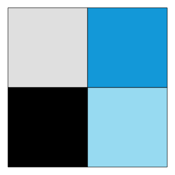
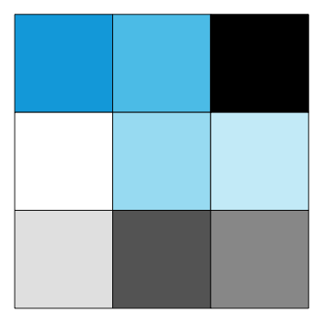

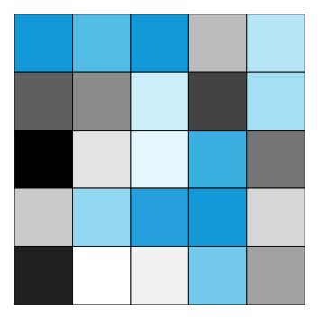

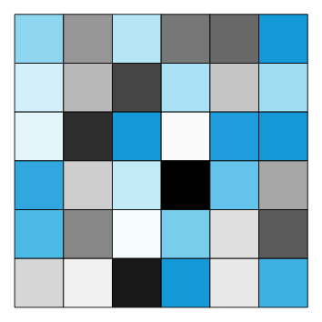

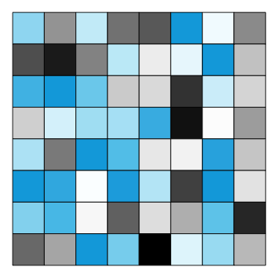
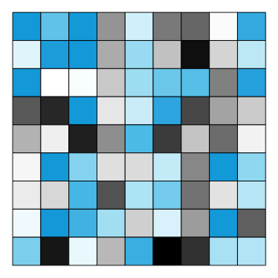
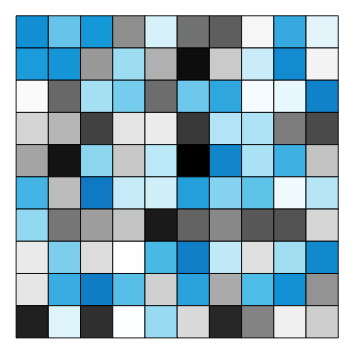

### Tile plots (sorted)


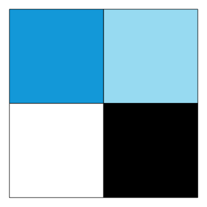
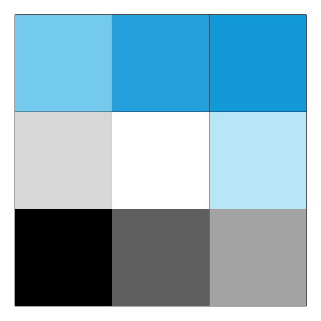

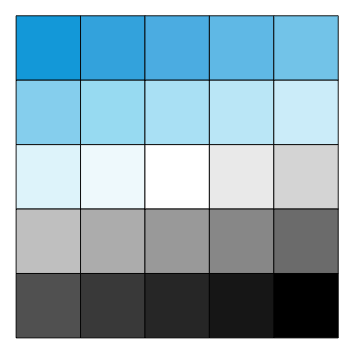

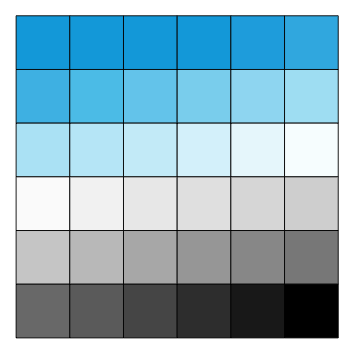
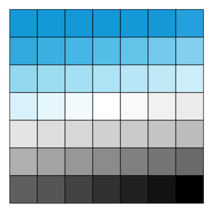
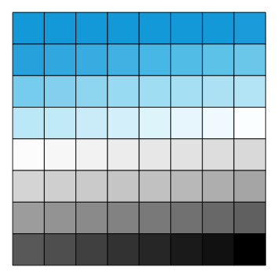


### Tile plots (with borders and numeric labels)

Random versions:


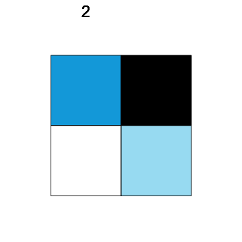
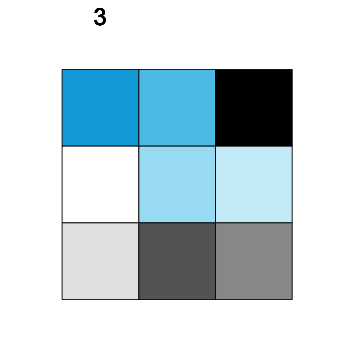
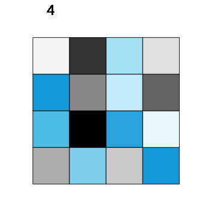
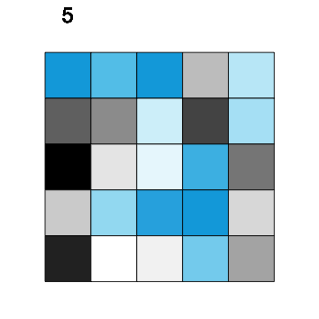
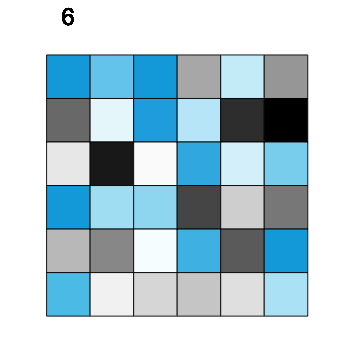
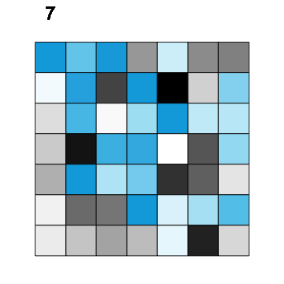
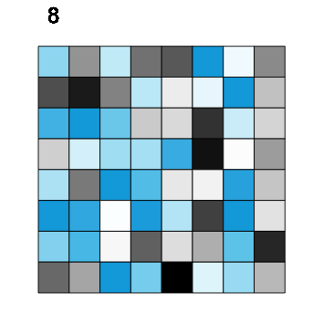
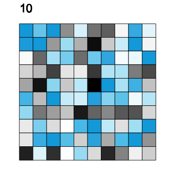
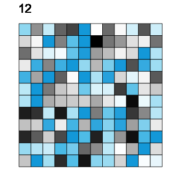
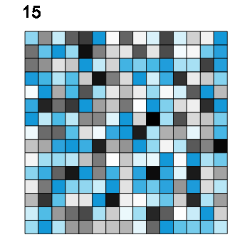

Sorted versions:

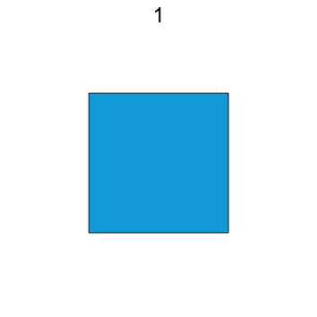
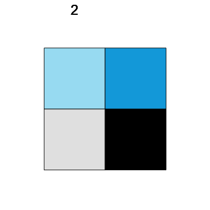
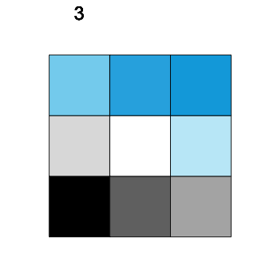
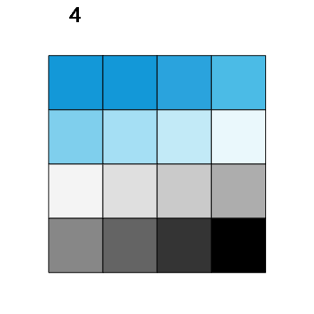
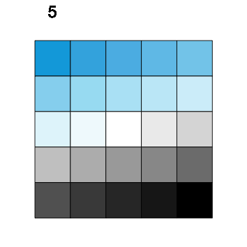

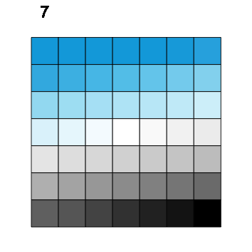
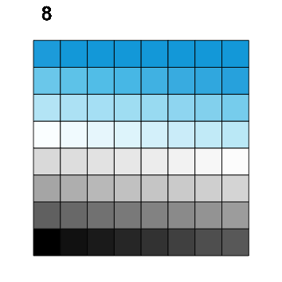
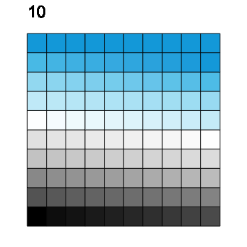
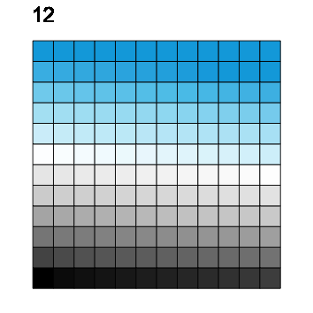
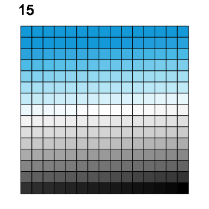

## Poles

Showing the versions _without_ borders:

### Pole plots (random)

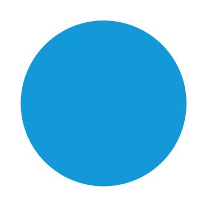


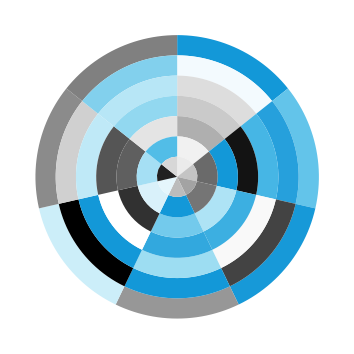

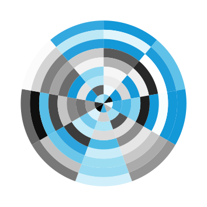


### Pole plots (sorted)


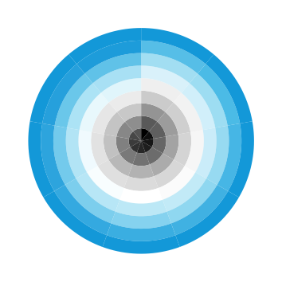
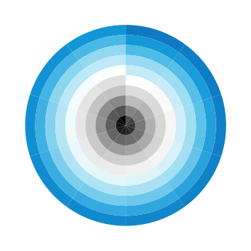

### Pole plots (with borders and numeric labels)

Random versions:

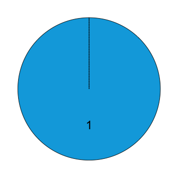
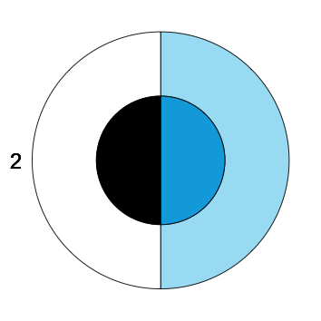
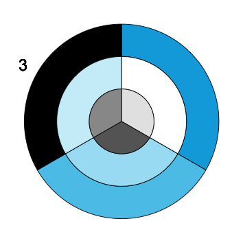
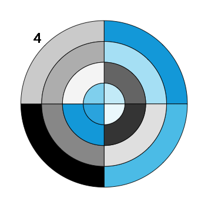
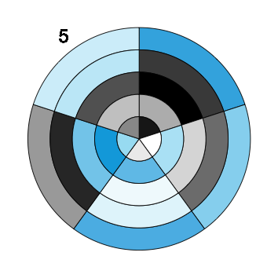
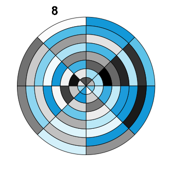
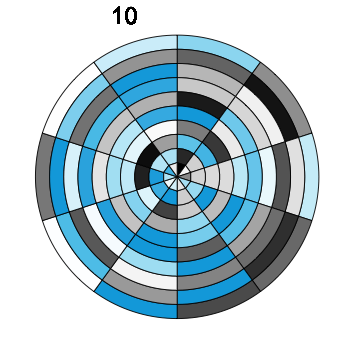
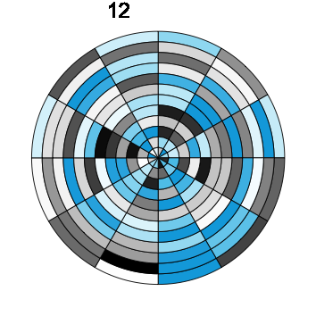
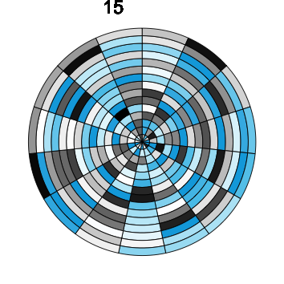

Sorted versions:


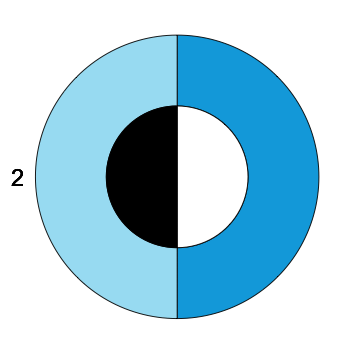
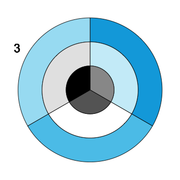

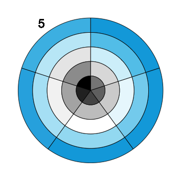


## Settings

### Text

```{r text_labels}
# Define text labels:
lbl_psi <- expression(psi)
course_title <- paste0("Data science\nfor psychologists")
course_title_abb <- paste0("ds4psy")
```

### Data

```{r data}
# Dimensions:
n_rand <- sample(1:15, size = 1, replace = TRUE)  # random integer in range

n_x <- n_rand  # random number
# n_x <- 9       # a specific number
n_y <- n_x
N <- (n_x * n_y)

# Vectors: 
v_sort <- 1:N       # Tile: bottom = seeblau; top = black | Polar: outer = black, center = seeblau.
v_sort <- rev(1:N)  # Tile: bottom = black; top = seeblau | Polar: outer = seeblau, center = black.

set.seed(123)  # for reproducible randomness
# v_rand <- runif(n = N, 0, 1)
v_rand <- sample(v_sort, N)  # random permutation of v_sort

# Table: 
tb <- tibble(y = rep(1:n_x, each = n_y),
             x = rep(1:n_y, times = n_x),
             rand = v_rand,
             sort = v_sort)
tb
```

### Colors

```{r colors}
# Re-sort color palette: 
unikn.pal  # from "ds4psy/R/custom_functions.R""

# (1) Sorted version:
unikn_sort <- unikn.pal[c(4, 4:1, 10:5)]  # 11 colors (seeblau twice) 
# unikn_sort  

# (2) Sorted version with special cases (for small n_x):
if (n_x == 1) {
  unikn_sort <- seeblau                     # 1 color (seeblau)
} else if (n_x == 2) {
  unikn_sort <- unikn.pal[c(4, 2, 5, 9)]    # 4 colors (black, but no white)
} else {
  unikn_sort <- unikn.pal[c(4, 4:1, 10:5)]  # 11 colors (seeblau twice)   
}

unikn_sort    
```

### Plot themes

```{r plot_parameters}
ds_theme <- theme_bw() + 
  theme(panel.grid = element_blank(),
        legend.position = "none",
        axis.text = element_blank(),
        axis.ticks = element_blank(),
        panel.background = element_rect(fill = "white"),
        panel.border = element_rect(color = grey(.25, 1)))

ds_theme <- theme_nothing()
```

## Tiles

### Tile plots 

1. _With_ thin borders:

```{r tile_plots_brd, fig.width = 3, fig.height = 3}
# Parameters: 
brd_col <- grey(0, 1)
brd_size <- .10

plot_size <-  3.0  # NORMAL: in cm (used in ggsave below): normal (small) size
# plot_size <- 10.0  # BIG:    in cm (used in ggsave below): when "pix/big_"

pic_path <- "pix/"

# Tile plots: ------ 

# (1a) random version (WITH border lines):
tile_rand <- ggplot(tb) +
  geom_tile(aes(x = x, y = y, fill = rand), col = brd_col, size = brd_size) +
  coord_fixed() + 
  # labs(title = "ds4psy") + 
  labs(x = "Data", y = "Science") +
  # scale_fill_continuous(low = "white", high = seeblau) +
  scale_fill_gradientn(colors = unikn_sort) +
  ds_theme
tile_rand

# Save current plot: 
cur_name <- paste0("tile_rand_", n_x, "_brd.png")
if (plot_size < 10) {
  plot_name <- paste0(pic_path, "tile/", cur_name)  # insert sub-dir "tile"
} else {
  plot_name <- paste0(pic_path, "big/", "big_", cur_name)  # sub-dir "big" and insert "big_" prefix
}
ggsave(plot_name, width = plot_size, height = plot_size, units = c("cm"), dpi = 300)

# (1b) sorted version (WITH border lines):
tile_sort <- ggplot(tb) +
  geom_tile(aes(x = x, y = y, fill = sort), col = brd_col, size = brd_size) +
  # coord_polar() +
  coord_fixed() + 
  # labs(title = "ds4psy") + 
  labs(x = "4", y = expression(psi)) +
  # scale_fill_continuous(low = "white", high = seeblau) +
  scale_fill_gradientn(colors = unikn_sort) +
  ds_theme
tile_sort

# Save current plot: 
cur_name <- paste0("tile_sort_", n_x, "_brd.png")
if (plot_size < 10) {
  plot_name <- paste0(pic_path, "tile/", cur_name)
} else {
  plot_name <- paste0(pic_path, "big/", "big_", cur_name)  # insert "big_" prefix
}
ggsave(plot_name, width = plot_size, height = plot_size, units = c("cm"), dpi = 300)
```

2. _Without_ thin borders:

```{r tile_plots_brdless, fig.width = 3, fig.height = 3}
# Tile plots: ------ 

# (2a) random version (withOUT border lines):
tile_rand <- ggplot(tb) +
  geom_tile(aes(x = x, y = y, fill = rand))+ #, col = brd_col, size = brd_size) +
  coord_fixed() + 
  # labs(title = "ds4psy") + 
  labs(x = "Data", y = "Science") +
  # scale_fill_continuous(low = "white", high = seeblau) +
  scale_fill_gradientn(colors = unikn_sort) +
  ds_theme
tile_rand

# Save current plot: 
cur_name <- paste0("tile_rand_", n_x, ".png")
if (plot_size < 10) {
  plot_name <- paste0(pic_path, "tile/", cur_name)
} else {
  plot_name <- paste0(pic_path, "big/", "big_", cur_name)  # insert "big_" prefix
}

ggsave(plot_name, width = plot_size, height = plot_size, units = c("cm"), dpi = 300)

# (2b) sorted version (withOUT border lines):

tile_sort <- ggplot(tb) +
  geom_tile(aes(x = x, y = y, fill = sort))+ #, col = brd_col, size = brd_size) +
  # coord_polar() +
  coord_fixed() + 
  # labs(title = "ds4psy") + 
  labs(x = "4", y = expression(psi)) +
  # scale_fill_continuous(low = "white", high = seeblau) +
  scale_fill_gradientn(colors = unikn_sort) +
  ds_theme
tile_sort

# Save current plot: 
cur_name <- paste0("tile_sort_", n_x, ".png")
if (plot_size < 10) {
  plot_name <- paste0(pic_path, "tile/", cur_name)
} else {
  plot_name <- paste0(pic_path, "big/", "big_", cur_name)  # insert "big_" prefix
}

ggsave(plot_name, width = plot_size, height = plot_size, units = c("cm"), dpi = 300)
```

3. With thin borders and a numeric label (top left):

```{r tile_plots_brd_lbl, fig.width = 3, fig.height = 3}
# Parameters:
cur_lbl <- paste0(n_x)

x_lbl <- 1 
y_lbl <- (n_y + 1) + n_y/15

# Tile plots: ------ 

# (3a) random version (WITH border lines AND label):
tile_rand_lbl <- ggplot(tb) +
  geom_tile(aes(x = x, y = y, fill = rand), col = brd_col, size = brd_size) +
  geom_text(x = x_lbl, y = y_lbl, label = cur_lbl, size = 2) +
  scale_y_continuous(limits = c(0, y_lbl)) + 
  # geom_text(x = 0, y = n_y, label = cur_lbl, size = 2) +
  # scale_x_continuous(limits = c(0, n_x + 1)) + 
  coord_fixed() + 
  # labs(title = "ds4psy") + 
  labs(x = "Data", y = "Science") +
  # scale_fill_continuous(low = "white", high = seeblau) +
  scale_fill_gradientn(colors = unikn_sort) +
  ds_theme
tile_rand_lbl

# Save current plot: 
cur_name <- paste0("tile_rand_", n_x, "_brd_lbl.png")
if (plot_size < 10) {
  plot_name <- paste0(pic_path, "tile/", cur_name)
} else {
  plot_name <- paste0(pic_path, "big/", "big_", cur_name)  # insert "big_" prefix
}
ggsave(plot_name, width = plot_size, height = plot_size, units = c("cm"), dpi = 300)


# (3b) sorted version (WITH border lines AND label):
tile_sort_lbl <- ggplot(tb) +
  geom_tile(aes(x = x, y = y, fill = sort), col = brd_col, size = brd_size) +
  geom_text(x = x_lbl, y = y_lbl, label = cur_lbl, size = 2) +
  scale_y_continuous(limits = c(0, y_lbl)) + 
  # geom_text(x = 0, y = n_y, label = cur_lbl, size = 2) +
  # scale_x_continuous(limits = c(0, n_x + 1)) + 
  coord_fixed() + 
  # labs(title = "ds4psy") + 
  labs(x = "Data", y = "Science") +
  # scale_fill_continuous(low = "white", high = seeblau) +
  scale_fill_gradientn(colors = unikn_sort) +
  ds_theme
tile_sort_lbl

# Save current plot: 
cur_name <- paste0("tile_sort_", n_x, "_brd_lbl.png")
if (plot_size < 10) {
  plot_name <- paste0(pic_path, "tile/", cur_name)
} else {
  plot_name <- paste0(pic_path, "big/", "big_", cur_name)  # insert "big_" prefix
}
ggsave(plot_name, width = plot_size, height = plot_size, units = c("cm"), dpi = 300)
```

### Polar plots

1. _With_ thin borders:

```{r polar_plots_brd, fig.width = 3, fig.height = 3}
# Polar plots: ------ 

pole_rand <- ggplot(tb) +
  geom_tile(aes(x = x, y = y, fill = rand), col = brd_col, size = brd_size) +
  # labs(title = "ds4psy") + 
  coord_polar() + 
  labs(x = "Data", y = "Science") +
  # scale_fill_continuous(low = "white", high = seeblau) +
  scale_fill_gradientn(colors = unikn_sort) +
  ds_theme
pole_rand

# Save current plot: 
plot_name <- paste0("pix/pole/pole_rand_", n_x, "_brd.png")
ggsave(plot_name, width = plot_size, height = plot_size, units = c("cm"), dpi = 300)

pole_sort <- ggplot(tb) +
  geom_tile(aes(x = x, y = y, fill = sort), col = brd_col, size = brd_size) +
  labs(x = "4", y = expression(psi)) +
  coord_polar() +
  # scale_fill_continuous(low = "white", high = seeblau) +
  scale_fill_gradientn(colors = unikn_sort) +
  ds_theme
pole_sort

# Save current plot: 
plot_name <- paste0("pix/pole/pole_sort_", n_x, "_brd.png")
ggsave(plot_name, width = plot_size, height = plot_size, units = c("cm"), dpi = 300)
```

2. _Without_ thin borders:

```{r polar_plots_brdless, fig.width = 3, fig.height = 3}
# Polar plots: ------ 

pole_rand <- ggplot(tb) +
  geom_tile(aes(x = x, y = y, fill = rand)) + # , col = brd_col, size = brd_size) +
  # labs(title = "ds4psy") + 
  coord_polar() + 
  labs(x = "Data", y = "Science") +
  # scale_fill_continuous(low = "white", high = seeblau) +
  scale_fill_gradientn(colors = unikn_sort) +
  ds_theme
pole_rand

# Save current plot: 
plot_name <- paste0("pix/pole/pole_rand_", n_x, ".png")
ggsave(plot_name, width = plot_size, height = plot_size, units = c("cm"), dpi = 300)

pole_sort <- ggplot(tb) +
  geom_tile(aes(x = x, y = y, fill = sort)) + # , col = brd_col, size = brd_size) +
  labs(x = "4", y = expression(psi)) +
  coord_polar() +
  # scale_fill_continuous(low = "white", high = seeblau) +
  scale_fill_gradientn(colors = unikn_sort) +
  ds_theme
pole_sort

# Save current plot: 
plot_name <- paste0("pix/pole/pole_sort_", n_x, ".png")
ggsave(plot_name, width = plot_size, height = plot_size, units = c("cm"), dpi = 300)
```

3. With thin borders and a numeric label (of the final slice):

```{r polar_plots_brd_lbl, fig.width = 3, fig.height = 3}
# Parameters:
cur_lbl <- paste0(n_x)

if (n_y == 1) {
  y_lbl <- n_y + 0     # no correction
} else if (n_y == 2) {
  y_lbl <- n_y + .75   # small correction
} else if (n_y < 4) {
  y_lbl <- n_y + 1     # constant correction
} else {
 y_lbl <- n_y + n_y/4  # scaled correction (increasing with n_y)
}

# (a) rand version with label:
pole_rand_lbl <- ggplot(tb) +
  geom_tile(aes(x = x, y = y, fill = rand), col = brd_col, size = brd_size) +
  # labs(title = "ds4psy") + 
  # scale_x_continuous(breaks = c(0:n_x), labels = c(0:n_x)) +
  # geom_vline(xintercept = n_x, size = 1, color = "gold") + 
  geom_text(x = n_x, y = y_lbl, label = cur_lbl, size = 2) + 
  coord_polar() + 
  labs(x = "Data", y = "Science") +
  # scale_fill_continuous(low = "white", high = seeblau) +
  scale_fill_gradientn(colors = unikn_sort) +
  ds_theme
pole_rand_lbl

# Save current plot: 
plot_name <- paste0("pix/pole/pole_rand_", n_x, "_brd_lbl.png")
ggsave(plot_name, width = plot_size, height = plot_size, units = c("cm"), dpi = 300)

# (a) sort version with label:
pole_sort_lbl <- ggplot(tb) +
  geom_tile(aes(x = x, y = y, fill = sort), col = brd_col, size = brd_size) +
  # labs(title = "ds4psy") + 
  # scale_x_continuous(breaks = c(0:n_x), labels = c(0:n_x)) +
  # geom_vline(xintercept = n_x, size = 1, color = "gold") + 
  geom_text(x = n_x, y = y_lbl, label = cur_lbl, size = 2) + 
  coord_polar() + 
  labs(x = "Data", y = "Science") +
  # scale_fill_continuous(low = "white", high = seeblau) +
  scale_fill_gradientn(colors = unikn_sort) +
  ds_theme
pole_sort_lbl

# Save current plot: 
plot_name <- paste0("pix/pole/pole_sort_", n_x, "_brd_lbl.png")
ggsave(plot_name, width = plot_size, height = plot_size, units = c("cm"), dpi = 300)
```


### Combine plots

```{r combine_plots, eval = FALSE, fig.width = 4, fig.height = 2}
plot_grid(tile_rand, tile_sort)

plot_grid(pole_rand, pole_sort)

plot_grid(tile_rand, pole_sort)
```

### Waves

Data:

```{r}
N <- 100000

df <- tibble(x = 1:N,
             a = rnorm(n = N, mean =   0, sd = 250),
             # b = rnorm(n = N, mean = 100, sd = 200), 
             c = rnorm(n = N, mean = 500, sd = 200)
)
# df
```

Density plots:

```{r waves_1, eval = FALSE, fig.width = 5, fig.height = 1}
lwd_all <- 3

ggplot(df) +
  geom_density(aes(x = a), col = seeblau, fill = "black", lwd = lwd_all, alpha = .25) +
  # geom_density(aes(x = b), col = "black", fill = unikn.pal[[5]], alpha = .33) + 
  geom_density(aes(x = c), col = "black", fill = seeblau, lwd = lwd_all, alpha = .33) +
  theme_void()
```

Histograms (with function curves):

```{r waves_2, fig.width = 8, fig.height = 4}
lwd_all <- .75

# overlay histogram and normal density
ggplot(df) +
  geom_histogram(aes(x = c, y = stat(density)), binwidth = 150, col = "white", fill = "black", alpha = .25) +
  geom_histogram(aes(x = a, y = stat(density)), binwidth = 150, col = "white", fill = seeblau, alpha = .25) +
  stat_function(fun = dnorm, args = list(mean = mean(df$c), sd = sd(df$c)), lwd = lwd_all, col = "black", alpha = .95) + 
  stat_function(fun = dnorm, args = list(mean = mean(df$a), sd = sd(df$a)), lwd = lwd_all, col = seeblau, alpha = .95) + 
  scale_x_continuous(limits = c(-2000, 1400)) +
  theme_void() # +
  # annotate(geom = "text", x = -1900, y = .0018, label = course_title, color = "black", alpha = .90, adj = 0, fontface = 2, size = 2.5)

ggsave("pix/wave/hist_wave_2.png", width = 16, height = 8, units = c("cm"), dpi = 300)
```

Waves (as curves):

```{r waves_3, fig.width = 8, fig.height = 1}
# as curves: 
lwd_all <- .75

ggplot(df) +
  stat_function(fun = dnorm, args = list(mean = 300, sd = 275), lwd = lwd_all, col = "black", alpha = .99) + 
  stat_function(fun = dnorm, args = list(mean =   0, sd = 300), lwd = lwd_all, col = seeblau, alpha = .40) + 
  stat_function(fun = dnorm, args = list(mean = 600, sd = 250), lwd = lwd_all, col = "black", alpha = .40) +
  stat_function(fun = dnorm, args = list(mean = 900, sd = 225), lwd = lwd_all, col = seeblau, alpha = .75) +
  scale_x_continuous(limits = c(-4000, 1700)) +
  theme_void() # +
  # annotate(geom = "text", x = -3900, y = .0016, label = course_title, color = "black", alpha = .90, adj = 0, fontface = 2, size = 2.5)

ggsave("pix/wave/waves_4.png", width = 15, height = 1.5, units = c("cm"), dpi = 300)
```

## Ideas

### ToC bar chart

ToC (chronology and relevance of sessions) as bar charts:

```{r plot_toc_data, fig.width = 8, fig.height = 8}
# N <- 10  # number of chapters/topics
# nr <- 1:N
# tp <- c("Introduction", "Chapter 2", "Chapter 3", "Chapter 4", "Chapter 5", 
#         "Chapter 6", "Chapter 7", "Chapter 8", "Chapter 9", "Chapter 10")
# val <- 10 + nr

# Table:
toc <- tribble(
  ~nr, ~tp,                 ~ctr,   
  0,  "Introduction",          3,  
  1, 	"Basic R",              10,  # was: "Basic R concepts and commands",
  2, 	"Visualizing data",      8, 
  3, 	"Transforming data",     9, 
  4, 	"Exploring data",       10,  # was: "Exploring data (EDA)"
  5, 	"Tibbles",               7,
  6, 	"Importing data",        5, 
  7, 	"Tidying data",          9, 
  8, 	"Joining data",          8, 
  9, 	"Functions",             9,
  10, "Iteration",             7
)

toc <- toc %>% mutate(nr_val = nr + 10) # add constant to increase overall height of bars

# Parameters:
N <- nrow(toc)
max_nr_val <- max(toc$nr_val)
min_ctr <- min(toc$ctr)
max_ctr <- max(toc$ctr)
tol <- 4  # tolerance value (for text labels)
txt_size <- 2.5  # size of txt labels (below)

## Colors: ------ 

# unikn.pal  # basic 

unikn_toc <- c(rev(unikn.pal[5:10]), # white:black (6) 
               unikn.pal[1:4],       # seeblau1 to 4 (4)
               seeblau)              # seeblau4 (1)
# unikn_toc  # 11 colors
```

Bar plots:

```{r plot_toc_bar, fig.width = 8, fig.height = 8}
## Bar plots: ------ 

# (a) Chronology:

bar_hori <- ggplot(toc, aes(x = nr)) +
  geom_bar(aes(y = ctr, fill = nr_val), stat = "identity", color = grey(.5, 1)) +
  scale_fill_gradientn(colors = unikn_toc) +
  geom_text(aes(y = ctr + .25, label = tp), angle = 0, adj = 0, size = txt_size) + 
  scale_x_reverse(breaks = 0:N, labels = 0:N) + 
  # scale_x_continuous(breaks = 0:N, labels = 0:N) + 
  scale_y_continuous(limits = c(0, (max_ctr + tol)), breaks = 1:max_ctr, labels = 1:max_ctr) + 
  theme_minimal() + 
  theme(legend.position = "none", panel.grid.minor = element_blank(), panel.grid.major.x = element_blank()) +
  coord_flip() + 
  labs(title = "ds4psy: Chronology of sessions", x = "Session", y = "Relevance")
bar_hori

# Save plot:
cur_name <- paste0(pic_path, "toc/", "toc_chronology", ".png")
ggsave(cur_name, width = 15, height = 10, units = c("cm"), dpi = 300)

# (b) Relevance:

bar_vert <- ggplot(toc, aes(x = nr)) +
  geom_bar(aes(y = ctr, fill = ctr), stat = "identity", color = grey(.5, 1)) +
  # scale_fill_gradientn(colors = unikn_toc) +
  scale_fill_gradient(low = "white", high = seeblau, limits = c(min_ctr, max_ctr)) +
  geom_text(aes(y = ctr + .5, label = tp), angle = 90, adj = 0, size = txt_size) + 
  scale_x_continuous(breaks = 0:N, labels = 0:N) + 
  scale_y_continuous(limits = c(0, (max_ctr + tol)), breaks = 1:max_ctr, labels = 1:max_ctr) + 
  theme_minimal() + 
  theme(legend.position = "none", panel.grid.minor = element_blank()) +
  labs(title = "ds4psy: Relevance of topics", x = "Session", y = "Relevance")
bar_vert

# Save plot:
cur_name <- paste0(pic_path, "toc/", "toc_relevance", ".png")
ggsave(cur_name, width = 15, height = 12, units = c("cm"), dpi = 300)
```

### ToC polar charts

ToC and current session as a clock chart (bar chart with polar coordinates):

```{r plot_toc_polar, fig.width = 8, fig.height = 8}
# (2) Plots on polar coordinates:

tol <- 4  # tolerance value (for text labels)

## (A) Chronology (as clock):

topic_clock <- ggplot(toc, aes(x = nr)) +
  geom_bar(aes(y = ctr, fill = nr_val), stat = "identity", color = grey(0, 1), size = .25) +
  scale_fill_gradientn(colors = unikn_toc) +
  # scale_fill_gradient(low = "white", high = seeblau, limits = c(min_ctr, max_ctr)) +
  geom_text(aes(y = max_ctr + tol/2, label = tp), adj = .5, size = txt_size) + 
  scale_x_continuous(breaks = 0:N, labels = 0:N) + 
  scale_y_continuous(limits = c(0, (max_ctr + tol)), breaks = 1:max_ctr, labels = 1:max_ctr) + 
  coord_polar() + 
  # labs(title = "Centrality of topic", x = "Chapter", y = "Topic") + 
  # theme_void() + 
  theme_light() + 
  theme(legend.position = "none", axis.line = element_blank(), 
        axis.title = element_blank(), axis.text.y = element_blank(),
        axis.ticks = element_blank(), panel.border = element_blank())
# topic_clock

## (B) Centrality of topic (as clock):

centrality <- ggplot(toc, aes(x = nr)) +
  geom_bar(aes(y = ctr, fill = ctr), stat = "identity", color = grey(.10, 1), size = .25) +
  # scale_fill_gradientn(colors = unikn_toc) +
  scale_fill_gradient(low = "white", high = seeblau, limits = c(min_ctr, max_ctr)) +
  geom_text(aes(y = (max_ctr + .65 * tol), label = tp), adj = .5, size = txt_size) + 
  scale_x_continuous(breaks = 0:N, labels = 0:N) + 
  scale_y_continuous(limits = c(0, (max_ctr + tol)), breaks = 1:max_ctr, labels = 1:max_ctr) + 
  coord_polar() + 
  # theme_void() + 
  theme_light() + 
  theme(#legend.position = "none", 
        axis.line = element_blank(), 
        axis.title = element_blank(), axis.text.y = element_blank(),
        axis.ticks = element_blank(), panel.border = element_blank()) +
  labs(fill = "Centrality:") 
centrality

# Save plot:
cur_name <- paste0(pic_path, "toc/", "centrality", ".png")
ggsave(cur_name, width = 15, height = 15, units = c("cm"), dpi = 300)
```

Current session clock: 

```{r plot_toc_clock, fig.width = 8, fig.height = 8}
# (C) Highlight the current session (in gold):
nr_session <- 6  # current session nr (as in polar clock plot above)
tol <- 8         # increase tolerance value (to leave more space for text labels)
txt_size <- 2.0  # decrease (to keep topic labels within highlighted areas)
  
# Add current session_val to toc:
toc$session_val <- 0  # initialize session_val
toc$session_val[(nr_session + 1)] <- (max_ctr + tol)  # maximum y-value
toc

cur_session_clock <- ggplot(toc, aes(x = nr)) +
  geom_bar(aes(y = session_val), stat = "identity", fill = "gold", alpha = .75) +
  geom_bar(aes(y = ctr, fill = ctr), stat = "identity", color = grey(.10, 1), size = .25) +
  # scale_fill_gradientn(colors = unikn_toc) +
  scale_fill_gradient(low = "white", high = seeblau, limits = c(min_ctr, max_ctr)) +
  geom_text(aes(y = (max_ctr + .45 * tol), label = tp), adj = .5, size = txt_size, fontface = 1) +    # topic labels
  scale_x_continuous(breaks = 0:N, labels = 0:N) + 
  scale_y_continuous(limits = c(0, (max_ctr + tol)), breaks = 1:max_ctr, labels = 1:max_ctr) + 
  coord_polar() + 
  # theme_void() + 
  theme_light() + 
  theme(legend.position = "none", 
        axis.line = element_blank(), 
        axis.title = element_blank(), axis.text.y = element_blank(),
        axis.ticks = element_blank(), panel.border = element_blank()) +
  labs(fill = "Centrality:") 
cur_session_clock

# Save plot:
cur_name <- paste0(pic_path, "toc/", "m_clock_", nr_session, ".png")
ggsave(cur_name, width = 10, height = 10, units = c("cm"), dpi = 300)
```

# R art

See <https://www.r-graph-gallery.com/portfolio/data-art/> for examples. 

## Matrix

```{r}
# plotting parameters: 
opar <- par(no.readonly = TRUE)  # all par settings that can be changed.
```

Original version: 

```{r matrix_original, eval = FALSE}
# Source: http://www.r-graph-gallery.com/56-matrix-abstract-painting/

# generate pairs of x-y values
nx = 100
ny = 80
x = sample(x = 1:nx, size = 90, replace = TRUE)
y = seq(-1, -ny, length = 90)
 
# set graphical parameters: 
op = par(bg = "black", mar = c(0, 0.2, 0, 0.2))
 
# plot: 
plot(1:nx, seq(-1, -nx), type = "n", xlim = c(1, nx), ylim = c(-ny+10, 1))
for (i in seq_along(x))
{
  aux = sample(1:ny, 1)
  points(rep(x[i], aux), y[1:aux], pch = sample(letters, aux, replace = TRUE), 
         col = hsv(0.35, 1, 1, runif(aux, 0.3)), cex = runif(aux, 0.3))
}
 
# signature: 
legend("bottomright", legend = "© Gaston Sanchez", bty = "n", text.col = "gray70")
```

Adpated version: 

```{r matrix_adapted, eval = FALSE, fig.width = 6, fig.height = 6}
# Source: http://www.r-graph-gallery.com/56-matrix-abstract-painting/
	
# generate pairs of x-y values
nx <- 100
ny <-  80

x <- sample(x = 1:nx, size = (nx - 10), replace = TRUE)
y <- seq(-1, -ny, length = (nx - 10))

# plotting parameters: 
op <- par(bg = "black", mar = c(0, 0.2, 0, 0.2))

seeblau_rgb <- col2rgb(seeblau)
seeblau_hsv <- rgb2hsv(seeblau_rgb)
unikn_sample <- c("d", "s", "4", "p", "s", "y",  
                  "3", "7", "9")

# Create empty plot:
plot(1:nx, seq(-1, -nx), type = "n", xlim = c(1, nx), ylim = c(-ny + 10, 1))

# Loop:
for (i in seq_along(x))
{
  aux = sample(1:ny, 1)
  points(rep(x[i], aux), y[1:aux], pch = sample(unikn_sample, aux, replace = TRUE), 
         col = hsv(seeblau_hsv[[1]], 1, 1, alpha = runif(aux, 0.3)), cex = runif(aux, 0.3))
}

## Save plot manually (as not a ggplot object)! 

## Clean up: 
par(opar)  # restore original plot settings
```

## Rings

Original version:

```{r rings_original, eval = FALSE, fig.width = 6, fig.height = 6}
# Source: http://www.r-graph-gallery.com/58-saturn-rings-abstract-painting/
	
# generate pairs of x-y values
x = seq(-50, 50, by = 1)
y = -(x^2)
 
# set graphic parameters
op = par(bg = 'black', mar = rep(0.5, 4))
 
# Plot 
plot(y, x, type = 'n')
lines(y, x, lwd = 2*runif(1), col = hsv(0.08, 1, 1, alpha = runif(1, 0.5, 0.9)))
for (i in seq(10, 2500, 10))
{
  lines(y-i, x, lwd = 2*runif(1), col = hsv(0.08, 1, 1, alpha = runif(1, 0.5, 0.9)))
}
for (i in seq(500, 600, 10))
{
  lines(y - i, x, lwd = 2*runif(1), col = hsv(0, 1, 1, alpha = runif(1, 0.5, 0.9)))
}
for (i in seq(2000, 2300, 10))
{
  lines(y - i, x, lwd = 2*runif(1), col = hsv(0, 1, 1, alpha = runif(1, 0.5, 0.9)))
}
for (i in seq(100, 150, 10))
{
  lines(y - i, x, lwd = 2*runif(1), col = hsv(0, 1, 1, alpha = runif(1, 0.5, 0.9)))
}
 
# signature
legend("bottomright", legend="© Gaston Sanchez", bty = "n", text.col="gray70")
```

Adapted version:

```{r rings_adapted, eval = FALSE, fig.width = 6, fig.height = 6}
# Adapted from: http://www.r-graph-gallery.com/58-saturn-rings-abstract-painting/
	
# generate pairs of x-y values:
x = seq(-50, 50, by = 1)
y = -(x^2)
 
# set graphic parameters:
op = par(bg = "black", mar = rep(.5, 4))
# op = par(bg = "white", mar = rep(.5, 4))

original_h <- .08  # original hue value
# Seeblau versions:
seeblau_rgb <- col2rgb(seeblau)
seeblau_hsv <- rgb2hsv(seeblau_rgb)
seeblau_hsv 
#  seeblau
# h 0.5409226
# s 1.0000000
# v 0.8784314

seeblau_h <- seeblau_hsv[[1]]

white_rgb <- col2rgb("white")
white_hsv <- rgb2hsv(white_rgb)
white_hsv  # 0 0 1

grey_rgb <- col2rgb("grey")
grey_hsv <- rgb2hsv(grey_rgb)
grey_hsv  # 0 0 0.75

# Plot: 
plot(y, x, type = 'n')

# one: 
lines(y, x, lwd = 2 * runif(1), col = hsv(seeblau_h, 1, 1, alpha = runif(1, .5, .9)))

# all: 
for (i in seq(10, 2500, 10)) {
  lines(y-i, x, lwd = 2 * runif(1), col = hsv(seeblau_h, 1, 1, alpha = runif(1, .5, .9)))
}

# inner: 
for (i in seq(500, 600, 10)) {
  lines(y - i, x, lwd = 2 * runif(1), col = hsv(0, 0, .75, alpha = runif(1, .5, .9)))
}

# middle:
for (i in seq(2000, 2300, 10)) {
  lines(y - i, x, lwd = 2 * runif(1), col = hsv(0, 0, .75, alpha = runif(1, .5, .9)))
}

# outer:
for (i in seq(100, 150, 10)){
  lines(y - i, x, lwd = 2 * runif(1), col = hsv(0, 0, .75, alpha = runif(1, .5, .9)))
}

## Save plot manually (as not a ggplot object)! 

## Clean up: 
par(opar)  # restore original plot settings
```

## Grasslands

Original version:

```{r grasslands_original, eval = FALSE, fig.width = 8, fig.height = 6}
# Source: https://www.r-graph-gallery.com/138-green-world-data-art/

library(ggplot2)
library(RColorBrewer)

set.seed(92)
ngroup=20
names=paste("G_",seq(1,ngroup),sep="")
DAT=data.frame()

for(i in seq(1:50)){
    data=data.frame( matrix(0, ngroup , 3))
    data[,1]=i
    data[,2]=sample(names, nrow(data))
    data[,3]=prop.table(sample( c(rep(0, 100), c(1:ngroup)), nrow(data)))
    DAT=rbind(DAT,data)
    }

colnames(DAT) = c("Year","Group","Value")
DAT = DAT[order(DAT$Year, DAT$Group), ]

ggplot(DAT, aes(x=Year, y=Value, fill=Group )) + 
    geom_area(alpha=1 , color="transparent" )+
    theme_bw() +
    scale_fill_brewer(palette="Greens", breaks=rev(levels(DAT$Group)))+
     theme(line = element_blank(),
        text = element_blank(),
        title = element_blank(),
        legend.position = "none",
        panel.border = element_blank(),
        panel.background = element_blank())
```

Adapted version:

```{r grasslands_modified, eval = FALSE, fig.width = 8, fig.height = 6}
# Adapted from: https://www.r-graph-gallery.com/138-green-world-data-art/

library(ggplot2)
library(RColorBrewer)

set.seed(101)

ngroup <- 20
names <- paste("G_", seq(1, ngroup), sep = "")
DAT <- data.frame()

# Color palette: 
seeblau_pal <- sample(unikn.pal, size = ngroup, replace = TRUE)
seeblau_pal <- rep(c(unikn.pal[1], unikn.pal[2], unikn.pal[3], unikn.pal[4], unikn.pal[5]), 4)

for(i in seq(1:50)){
    data = data.frame( matrix(0, ngroup , 3))
    data[ , 1] = i
    data[ , 2] = sample(names, nrow(data))
    data[ , 3] = prop.table(sample( c(rep(0, 100), c(1:ngroup)), nrow(data)))
    DAT = rbind(DAT, data)
    }

colnames(DAT) <- c("x", "group", "value")
DAT <- DAT[order(DAT$x, DAT$group), ]

dim(DAT)

ggplot(DAT, aes(x = x, y = value, fill = group)) + 
  geom_area(alpha = 1, color = "transparent") +
  theme_bw() +
  scale_fill_brewer(palette = "Blues", breaks = rev(levels(DAT$group))) +
  theme(line = element_blank(),
        text = element_blank(),
        title = element_blank(),
        legend.position = "none",
        panel.border = element_blank(),
        panel.background = element_blank()
  )

## Save plot:
# cur_name <- paste0(pic_path, "art_grass", ".png")
# ggsave(cur_name, width = 15, height = 10, units = c("cm"), dpi = 300)
```

## Harmonographs

Original version:

```{r harmonographs_original, eval = FALSE, fig.width = 8, fig.height = 6}
# Source: https://fronkonstin.com/2014/10/13/beautiful-curves-the-harmonograph/ 

f1 = jitter(sample(c(2,3),1)); f2 = jitter(sample(c(2,3),1)); f3 = jitter(sample(c(2,3),1)); f4 = jitter(sample(c(2,3),1))

d1 = runif(1,0,1e-02); d2=runif(1,0,1e-02); d3=runif(1,0,1e-02); d4=runif(1,0,1e-02)
p1 = runif(1,0,pi); p2=runif(1,0,pi); p3=runif(1,0,pi); p4=runif(1,0,pi)
xt = function(t) exp(-d1*t)*sin(t*f1+p1)+exp(-d2*t)*sin(t*f2+p2)
yt = function(t) exp(-d3*t)*sin(t*f3+p3)+exp(-d4*t)*sin(t*f4+p4)
t=seq(1, 100, by=.001)
dat = data.frame(t=t, x=xt(t), y=yt(t))
with(dat, plot(x, y, type="l", xlim =c(-2,2), ylim =c(-2,2), xlab = "", ylab = "", xaxt='n', yaxt='n'))
```

Adapted version:

```{r harmonographs_adapted, eval = FALSE, fig.width = 4, fig.height = 4}
# Adapted from: https://fronkonstin.com/2014/10/13/beautiful-curves-the-harmonograph/ 

seed <- 202
set.seed(seed)

f1 = jitter(sample(c(2, 3), 1))  
f2 = jitter(sample(c(2, 3), 1))  
f3 = jitter(sample(c(2, 3), 1))  
f4 = jitter(sample(c(2, 3), 1))

d1 = runif(1, 0, 1e-02)  
d2 = runif(1, 0, 1e-02)  
d3 = runif(1, 0, 1e-02)  
d4 = runif(1, 0, 1e-02)

p1 = runif(1, 0, pi)  
p2 = runif(1, 0, pi)  
p3 = runif(1, 0, pi)  
p4 = runif(1, 0, pi)

t = seq(1, 100, by = .001)

xt = function(t) exp(-d1 * t) * sin(t * f1 + p1) + 
                 exp(-d2 * t) * sin(t * f2 + p2)

yt = function(t) exp(-d3 * t) * sin(t * f3 + p3) + 
                 exp(-d4 * t) * sin(t * f4 + p4)

df = data.frame(t = t, x = xt(t), y = yt(t))
df

## Plot: ------ 

with(df, plot(x, y, type = "l", col = seeblau,  
               xlim = c(-2, 2), ylim = c(-2, 2), 
               xlab = "", ylab = "", 
               xaxt = 'n', yaxt = 'n'))

## Add text label: ------ 

add_label <- TRUE

if (add_label) {
  cur_lbl <- "Session X: Title of current topic"
  
  x_pos <- -2.12  # min(df$x)
  y_pos <-  2.33  # max(df$y)
  
  text(x = x_pos, y = y_pos, labels = cur_lbl, col = grey(.33, 1), adj = 0, font = 1, 
       xpd = TRUE  # FALSE = plot region; TRUE = figure region; NA = device region.
       )
}
```

Ideas:

- Always combine 2 similar shapes: 
    - wirr: perceptually random version 
    - klar: seemingly systematic version 
- Remove frame (or make a square)
- Consider adding chapter numbers and titles?

[This file last updated on `r Sys.time()` by [hn](http://neth.de/).]


<!-- eof. --> 