```{r preamble, echo = FALSE, eval = TRUE, cache = FALSE, message = FALSE, warning = FALSE}
## (a) Housekeeping: -----
rm(list=ls()) # clean all.

## (b) Current file name and path: ----- 
# cur.path <- dirname(rstudioapi::getActiveDocumentContext()$path)
# cur.path
# setwd(cur.path) # set to current directory
setwd("~/Desktop/stuff/Dropbox/_code/R/_teachR/ds4psy/") # set to current directory
# list.files() # all files + folders in current directory
fileName <- "logo.Rmd"

## (c) Packages: ----- 
library(knitr)
library(rmdformats)
library(tidyverse)
library(cowplot)

## (d) Global options: ----- 
options(max.print = "75")
opts_chunk$set(echo = TRUE,
	             cache = FALSE,
               prompt = FALSE,
               tidy = FALSE,
               collapse = TRUE, # set TRUE in answers 
               comment = "#>",
               message = FALSE,
               warning = FALSE,
               ## Default figure options:
               fig.width = 6, 
               fig.asp = .618, # golden ratio
               out.width = "75%",
               fig.align = "center"
               )
opts_knit$set(width = 75)

## (e) Custom functions: ----- 
source(file = "~/Desktop/stuff/Dropbox/_code/R/_teachR/ds4psy/R/custom_functions.R")
```

# Course Coordinates

<!-- ds4psy logo: -->
<a href="http://rpository.com/ds4psy/">
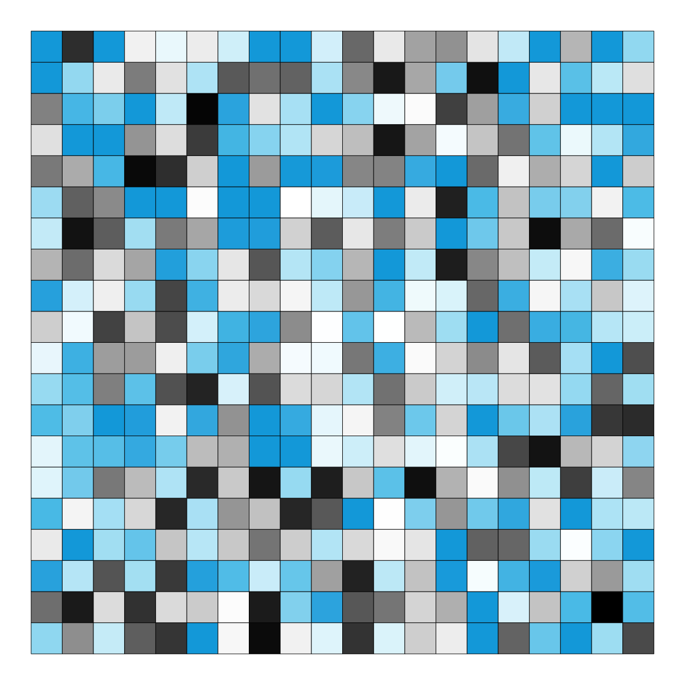
</a>

<!-- uni.kn logo and link to SPDS: -->  
<!--  --> 
<a href="https://www.spds.uni-konstanz.de/">

<!--  --> 
</a>

* Taught at the [University of Konstanz](https://www.uni-konstanz.de/) by [Hansjörg Neth](http://neth.de/) (<h.neth@uni.kn>,  [SPDS](https://www.spds.uni-konstanz.de/), office D507).
* Winter 2018/2019: Mondays, 13:30--15:00, C511. 
* Links to current [course syllabus](http://rpository.com/ds4psy/) | [ZeUS](https://zeus.uni-konstanz.de/hioserver/pages/startFlow.xhtml?_flowId=detailView-flow&unitId=5101&periodId=78&navigationPosition=hisinoneLehrorganisation,examEventOverviewOwn) |  [Ilias](https://ilias.uni-konstanz.de/ilias/goto_ilias_uni_crs_809936.html) 

# Logo

Overview over generated plots: 

## Tiles

Showing the versions _with_ borders:

### Tile plots (random)


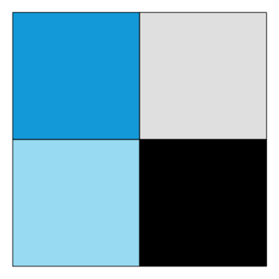
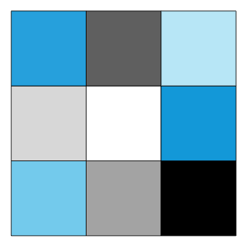
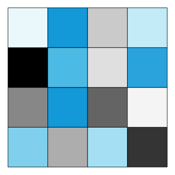
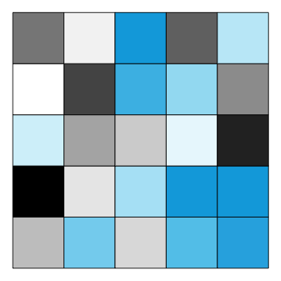

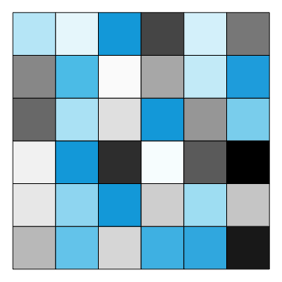
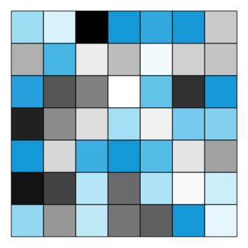
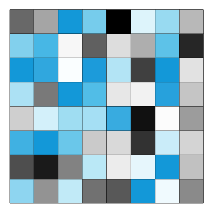
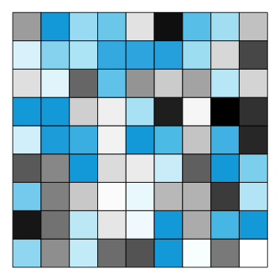
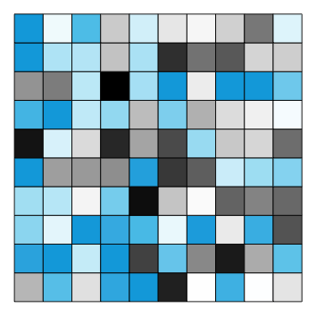

### Tile plots (sorted)

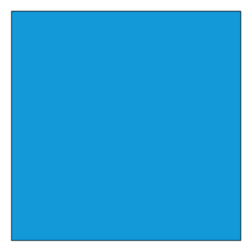
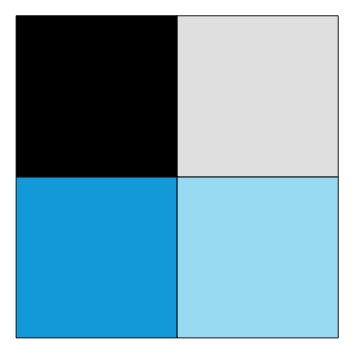
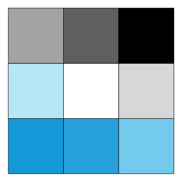
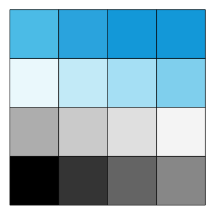
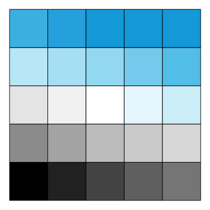

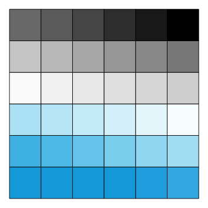
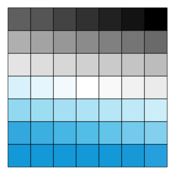
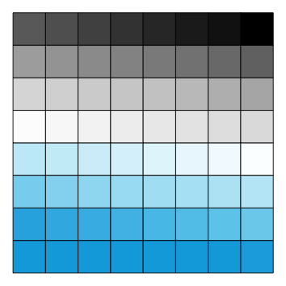
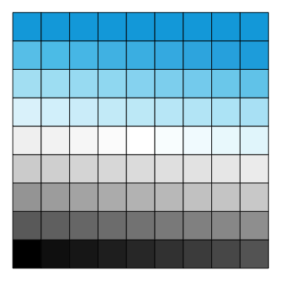
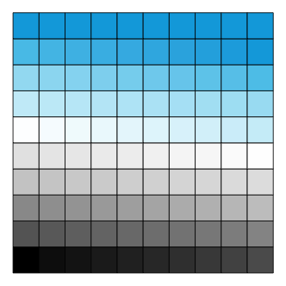


### Tile plots (with borders and numeric labels)

Random versions:

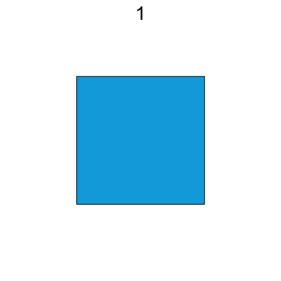
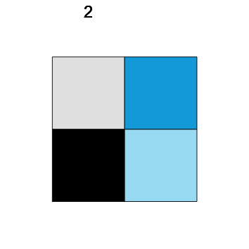

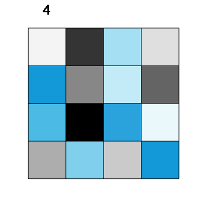
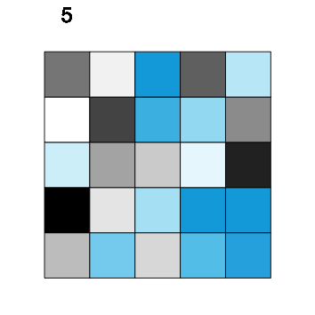

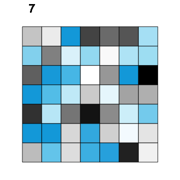
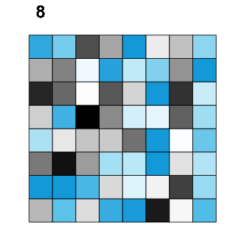
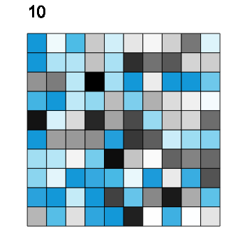
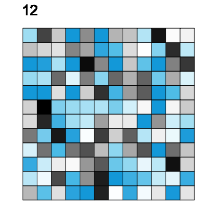
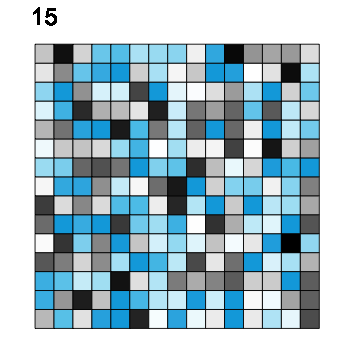

Sorted versions:


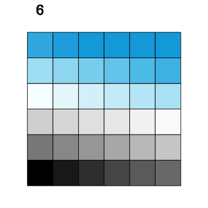


## Poles

Showing the versions _without_ borders:

### Pole plots (random)


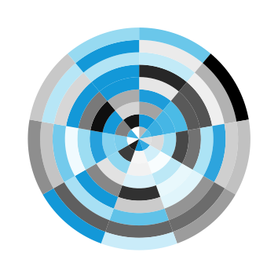
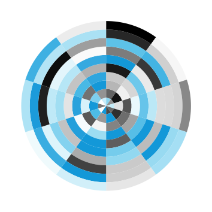

### Pole plots (sorted)


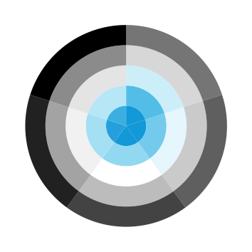

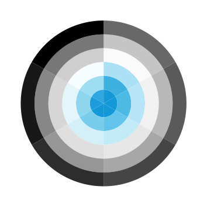


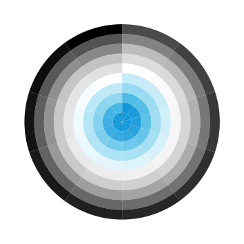

### Pole plots (with borders and numeric labels)

Random versions:


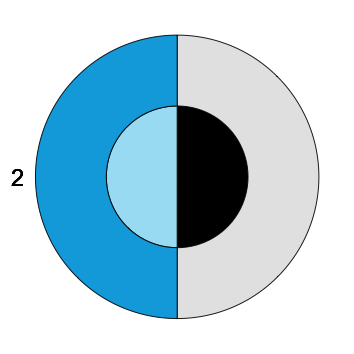
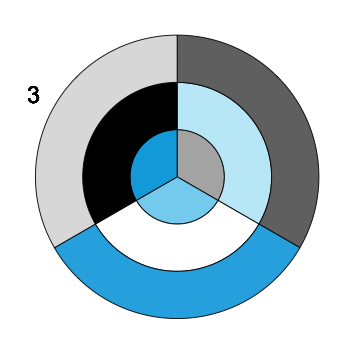
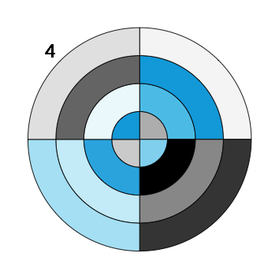
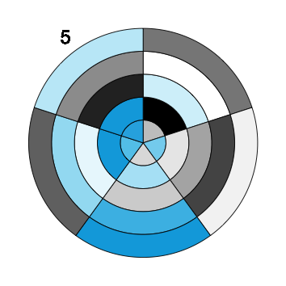

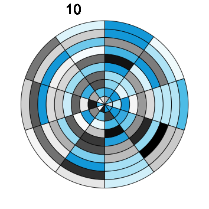
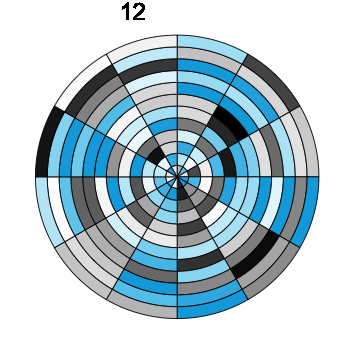


Sorted versions:


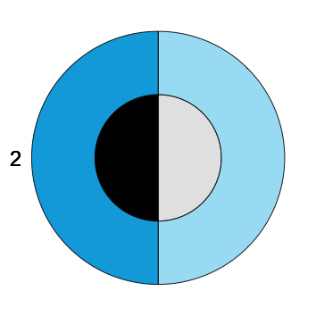
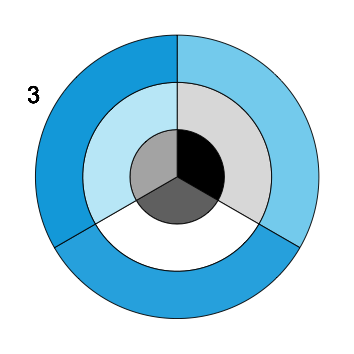
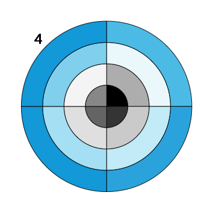
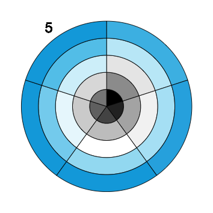


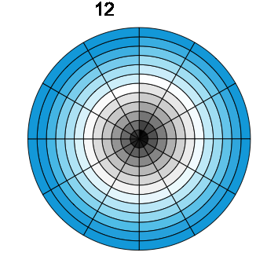
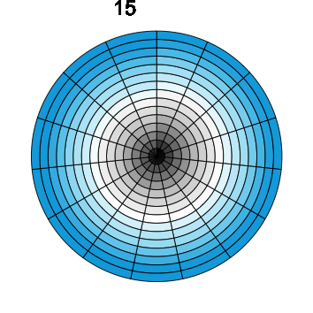

## Settings

### Text

```{r text_labels}
# Define text labels:
lbl_psi <- expression(psi)
course_title <- paste0("Data science\nfor psychologists")
course_title_abb <- paste0("ds4psy")
```

### Data

```{r data}
# Dimensions:
n_rand <- sample(1:15, size = 1, replace = TRUE)  # random integer in range

n_x <- n_rand  # random number
n_x <- 9      # specific number
n_y <- n_x
N <- (n_x * n_y)

# Vectors: 
v_sort <- 1:N       # Tile: bottom = seeblau; top = black | Polar: outer = black, center = seeblau.
v_sort <- rev(1:N)  # Tile: bottom = black; top = seeblau | Polar: outer = seeblau, center = black.

set.seed(123)  # for reproducible randomness
# v_rand <- runif(n = N, 0, 1)
v_rand <- sample(v_sort, N)  # random permutation of v_sort

# Table: 
tb <- tibble(y = rep(1:n_x, each = n_y),
             x = rep(1:n_y, times = n_x),
             rand = v_rand,
             sort = v_sort)
tb
```

### Colors

```{r colors}
# Re-sort color palette: 
unikn.pal  # from "ds4psy/R/custom_functions.R""

# (1) Sorted version:
unikn_sort <- unikn.pal[c(4, 4:1, 10:5)]  # 11 colors (seeblau twice) 
# unikn_sort  

# (2) Sorted version with special cases (for small n_x):
if (n_x == 1) {
  unikn_sort <- seeblau                     # 1 color (seeblau)
} else if (n_x == 2) {
  unikn_sort <- unikn.pal[c(4, 2, 5, 9)]    # 4 colors (black, but no white)
} else {
  unikn_sort <- unikn.pal[c(4, 4:1, 10:5)]  # 11 colors (seeblau twice)   
}

unikn_sort    
```

### Plot themes

```{r plot_parameters}
ds_theme <- theme_bw() + 
  theme(panel.grid = element_blank(),
        legend.position = "none",
        axis.text = element_blank(),
        axis.ticks = element_blank(),
        panel.background = element_rect(fill = "white"),
        panel.border = element_rect(color = grey(.25, 1)))

ds_theme <- theme_nothing()
```

## Tiles

### Tile plots 

1. _With_ thin borders:

```{r tile_plots_brd, fig.width = 3, fig.height = 3}
# Parameters: 
brd_col <- grey(0, 1)
brd_size <- .10

plot_size <-  3.0  # NORMAL: in cm (used in ggsave below): normal (small) size
# plot_size <- 10.0  # BIG:    in cm (used in ggsave below): when "pix/big_"

pic_path <- "pix/"


# Tile plots: ------ 

# (1a) random version (WITH border lines):
tile_rand <- ggplot(tb) +
  geom_tile(aes(x = x, y = y, fill = rand), col = brd_col, size = brd_size) +
  coord_fixed() + 
  # labs(title = "ds4psy") + 
  labs(x = "Data", y = "Science") +
  # scale_fill_continuous(low = "white", high = seeblau) +
  scale_fill_gradientn(colors = unikn_sort) +
  ds_theme
tile_rand

# Save current plot: 
cur_name <- paste0("tile_rand_", n_x, "_brd.png")
if (plot_size < 10) {
  plot_name <- paste0(pic_path, cur_name)
} else {
  plot_name <- paste0(pic_path, "big_", cur_name)  # insert "big_" prefix
}
ggsave(plot_name, width = plot_size, height = plot_size, units = c("cm"), dpi = 300)

# (1b) sorted version (WITH border lines):
tile_sort <- ggplot(tb) +
  geom_tile(aes(x = x, y = y, fill = sort), col = brd_col, size = brd_size) +
  # coord_polar() +
  coord_fixed() + 
  # labs(title = "ds4psy") + 
  labs(x = "4", y = expression(psi)) +
  # scale_fill_continuous(low = "white", high = seeblau) +
  scale_fill_gradientn(colors = unikn_sort) +
  ds_theme
tile_sort

# Save current plot: 
cur_name <- paste0("tile_sort_", n_x, "_brd.png")
if (plot_size < 10) {
  plot_name <- paste0(pic_path, cur_name)
} else {
  plot_name <- paste0(pic_path, "big_", cur_name)  # insert "big_" prefix
}
ggsave(plot_name, width = plot_size, height = plot_size, units = c("cm"), dpi = 300)
```

2. _Without_ thin borders:

```{r tile_plots_brdless, fig.width = 3, fig.height = 3}
# Tile plots: ------ 

# (2a) random version (withOUT border lines):
tile_rand <- ggplot(tb) +
  geom_tile(aes(x = x, y = y, fill = rand))+ #, col = brd_col, size = brd_size) +
  coord_fixed() + 
  # labs(title = "ds4psy") + 
  labs(x = "Data", y = "Science") +
  # scale_fill_continuous(low = "white", high = seeblau) +
  scale_fill_gradientn(colors = unikn_sort) +
  ds_theme
tile_rand

# Save current plot: 
cur_name <- paste0("tile_rand_", n_x, ".png")
if (plot_size < 10) {
  plot_name <- paste0(pic_path, cur_name)
} else {
  plot_name <- paste0(pic_path, "big_", cur_name)  # insert "big_" prefix
}

ggsave(plot_name, width = plot_size, height = plot_size, units = c("cm"), dpi = 300)

# (2b) sorted version (withOUT border lines):

tile_sort <- ggplot(tb) +
  geom_tile(aes(x = x, y = y, fill = sort))+ #, col = brd_col, size = brd_size) +
  # coord_polar() +
  coord_fixed() + 
  # labs(title = "ds4psy") + 
  labs(x = "4", y = expression(psi)) +
  # scale_fill_continuous(low = "white", high = seeblau) +
  scale_fill_gradientn(colors = unikn_sort) +
  ds_theme
tile_sort

# Save current plot: 
cur_name <- paste0("tile_sort_", n_x, ".png")
if (plot_size < 10) {
  plot_name <- paste0(pic_path, cur_name)
} else {
  plot_name <- paste0(pic_path, "big_", cur_name)  # insert "big_" prefix
}

ggsave(plot_name, width = plot_size, height = plot_size, units = c("cm"), dpi = 300)
```

3. With thin borders and a numeric label (top left):

```{r tile_plots_brd_lbl, fig.width = 3, fig.height = 3}
# Parameters:
cur_lbl <- paste0(n_x)

x_lbl <- 1 
y_lbl <- (n_y + 1) + n_y/15

# Tile plots: ------ 

# (3a) random version (WITH border lines AND label):
tile_rand_lbl <- ggplot(tb) +
  geom_tile(aes(x = x, y = y, fill = rand), col = brd_col, size = brd_size) +
  geom_text(x = x_lbl, y = y_lbl, label = cur_lbl, size = 2) +
  scale_y_continuous(limits = c(0, y_lbl)) + 
  # geom_text(x = 0, y = n_y, label = cur_lbl, size = 2) +
  # scale_x_continuous(limits = c(0, n_x + 1)) + 
  coord_fixed() + 
  # labs(title = "ds4psy") + 
  labs(x = "Data", y = "Science") +
  # scale_fill_continuous(low = "white", high = seeblau) +
  scale_fill_gradientn(colors = unikn_sort) +
  ds_theme
tile_rand_lbl

# Save current plot: 
cur_name <- paste0("tile_rand_", n_x, "_brd_lbl.png")
if (plot_size < 10) {
  plot_name <- paste0(pic_path, cur_name)
} else {
  plot_name <- paste0(pic_path, "big_", cur_name)  # insert "big_" prefix
}
ggsave(plot_name, width = plot_size, height = plot_size, units = c("cm"), dpi = 300)


# (3b) sorted version (WITH border lines AND label):
tile_sort_lbl <- ggplot(tb) +
  geom_tile(aes(x = x, y = y, fill = sort), col = brd_col, size = brd_size) +
  geom_text(x = x_lbl, y = y_lbl, label = cur_lbl, size = 2) +
  scale_y_continuous(limits = c(0, y_lbl)) + 
  # geom_text(x = 0, y = n_y, label = cur_lbl, size = 2) +
  # scale_x_continuous(limits = c(0, n_x + 1)) + 
  coord_fixed() + 
  # labs(title = "ds4psy") + 
  labs(x = "Data", y = "Science") +
  # scale_fill_continuous(low = "white", high = seeblau) +
  scale_fill_gradientn(colors = unikn_sort) +
  ds_theme
tile_sort_lbl

# Save current plot: 
cur_name <- paste0("tile_sort_", n_x, "_brd_lbl.png")
if (plot_size < 10) {
  plot_name <- paste0(pic_path, cur_name)
} else {
  plot_name <- paste0(pic_path, "big_", cur_name)  # insert "big_" prefix
}
ggsave(plot_name, width = plot_size, height = plot_size, units = c("cm"), dpi = 300)
```

### Polar plots

1. _With_ thin borders:

```{r polar_plots_brd, fig.width = 3, fig.height = 3}
# Polar plots: ------ 

pole_rand <- ggplot(tb) +
  geom_tile(aes(x = x, y = y, fill = rand), col = brd_col, size = brd_size) +
  # labs(title = "ds4psy") + 
  coord_polar() + 
  labs(x = "Data", y = "Science") +
  # scale_fill_continuous(low = "white", high = seeblau) +
  scale_fill_gradientn(colors = unikn_sort) +
  ds_theme
pole_rand

# Save current plot: 
plot_name <- paste0("pix/pole_rand_", n_x, "_brd.png")
ggsave(plot_name, width = plot_size, height = plot_size, units = c("cm"), dpi = 300)

pole_sort <- ggplot(tb) +
  geom_tile(aes(x = x, y = y, fill = sort), col = brd_col, size = brd_size) +
  labs(x = "4", y = expression(psi)) +
  coord_polar() +
  # scale_fill_continuous(low = "white", high = seeblau) +
  scale_fill_gradientn(colors = unikn_sort) +
  ds_theme
pole_sort

# Save current plot: 
plot_name <- paste0("pix/pole_sort_", n_x, "_brd.png")
ggsave(plot_name, width = plot_size, height = plot_size, units = c("cm"), dpi = 300)
```

2. _Without_ thin borders:

```{r polar_plots_brdless, fig.width = 3, fig.height = 3}
# Polar plots: ------ 

pole_rand <- ggplot(tb) +
  geom_tile(aes(x = x, y = y, fill = rand)) + # , col = brd_col, size = brd_size) +
  # labs(title = "ds4psy") + 
  coord_polar() + 
  labs(x = "Data", y = "Science") +
  # scale_fill_continuous(low = "white", high = seeblau) +
  scale_fill_gradientn(colors = unikn_sort) +
  ds_theme
pole_rand

# Save current plot: 
plot_name <- paste0("pix/pole_rand_", n_x, ".png")
ggsave(plot_name, width = plot_size, height = plot_size, units = c("cm"), dpi = 300)

pole_sort <- ggplot(tb) +
  geom_tile(aes(x = x, y = y, fill = sort)) + # , col = brd_col, size = brd_size) +
  labs(x = "4", y = expression(psi)) +
  coord_polar() +
  # scale_fill_continuous(low = "white", high = seeblau) +
  scale_fill_gradientn(colors = unikn_sort) +
  ds_theme
pole_sort

# Save current plot: 
plot_name <- paste0("pix/pole_sort_", n_x, ".png")
ggsave(plot_name, width = plot_size, height = plot_size, units = c("cm"), dpi = 300)
```

3. With thin borders and a numeric label (of the final slice):

```{r polar_plots_brd_lbl, fig.width = 3, fig.height = 3}
# Parameters:
cur_lbl <- paste0(n_x)

if (n_y == 1) {
  y_lbl <- n_y + 0     # no correction
} else if (n_y == 2) {
  y_lbl <- n_y + .75   # small correction
} else if (n_y < 4) {
  y_lbl <- n_y + 1     # constant correction
} else {
 y_lbl <- n_y + n_y/4  # scaled correction (increasing with n_y)
}

# (a) rand version with label:
pole_rand_lbl <- ggplot(tb) +
  geom_tile(aes(x = x, y = y, fill = rand), col = brd_col, size = brd_size) +
  # labs(title = "ds4psy") + 
  # scale_x_continuous(breaks = c(0:n_x), labels = c(0:n_x)) +
  # geom_vline(xintercept = n_x, size = 1, color = "gold") + 
  geom_text(x = n_x, y = y_lbl, label = cur_lbl, size = 2) + 
  coord_polar() + 
  labs(x = "Data", y = "Science") +
  # scale_fill_continuous(low = "white", high = seeblau) +
  scale_fill_gradientn(colors = unikn_sort) +
  ds_theme
pole_rand_lbl

# Save current plot: 
plot_name <- paste0("pix/pole_rand_", n_x, "_brd_lbl.png")
ggsave(plot_name, width = plot_size, height = plot_size, units = c("cm"), dpi = 300)

# (a) sort version with label:
pole_sort_lbl <- ggplot(tb) +
  geom_tile(aes(x = x, y = y, fill = sort), col = brd_col, size = brd_size) +
  # labs(title = "ds4psy") + 
  # scale_x_continuous(breaks = c(0:n_x), labels = c(0:n_x)) +
  # geom_vline(xintercept = n_x, size = 1, color = "gold") + 
  geom_text(x = n_x, y = y_lbl, label = cur_lbl, size = 2) + 
  coord_polar() + 
  labs(x = "Data", y = "Science") +
  # scale_fill_continuous(low = "white", high = seeblau) +
  scale_fill_gradientn(colors = unikn_sort) +
  ds_theme
pole_sort_lbl

# Save current plot: 
plot_name <- paste0("pix/pole_sort_", n_x, "_brd_lbl.png")
ggsave(plot_name, width = plot_size, height = plot_size, units = c("cm"), dpi = 300)
```


### Combine plots

```{r combine_plots, eval = FALSE, fig.width = 4, fig.height = 2}
plot_grid(tile_rand, tile_sort)

plot_grid(pole_rand, pole_sort)

plot_grid(tile_rand, pole_sort)
```

### Waves

Data:

```{r}
N <- 100000

df <- tibble(x = 1:N,
             a = rnorm(n = N, mean =   0, sd = 250),
             # b = rnorm(n = N, mean = 100, sd = 200), 
             c = rnorm(n = N, mean = 500, sd = 200)
)
# df
```

Density plots:

```{r waves_1, eval = FALSE, fig.width = 5, fig.height = 1}
lwd_all <- 3

ggplot(df) +
  geom_density(aes(x = a), col = seeblau, fill = "black", lwd = lwd_all, alpha = .25) +
  # geom_density(aes(x = b), col = "black", fill = unikn.pal[[5]], alpha = .33) + 
  geom_density(aes(x = c), col = "black", fill = seeblau, lwd = lwd_all, alpha = .33) +
  theme_void()
```

Histograms (with function curves):

```{r waves_2, fig.width = 8, fig.height = 1}
lwd_all <- .75

# overlay histogram and normal density
ggplot(df) +
  geom_histogram(aes(x = c, y = stat(density)), binwidth = 150, col = "white", fill = "black", alpha = .25) +
  geom_histogram(aes(x = a, y = stat(density)), binwidth = 150, col = "white", fill = seeblau, alpha = .25) +
  stat_function(fun = dnorm, args = list(mean = mean(df$c), sd = sd(df$c)), lwd = lwd_all, col = "black", alpha = .95) + 
  stat_function(fun = dnorm, args = list(mean = mean(df$a), sd = sd(df$a)), lwd = lwd_all, col = seeblau, alpha = .95) + 
  scale_x_continuous(limits = c(-2000, 1400)) +
  theme_void() # +
  # annotate(geom = "text", x = -1900, y = .0018, label = course_title, color = "black", alpha = .90, adj = 0, fontface = 2, size = 2.5)
```

Waves (as curves):

```{r waves_3, fig.width = 8, fig.height = 1}
# as curves: 
lwd_all <- .75

ggplot(df) +
  stat_function(fun = dnorm, args = list(mean = 300, sd = 275), lwd = lwd_all, col = "black", alpha = .99) + 
  stat_function(fun = dnorm, args = list(mean =   0, sd = 300), lwd = lwd_all, col = seeblau, alpha = .40) + 
  stat_function(fun = dnorm, args = list(mean = 600, sd = 250), lwd = lwd_all, col = "black", alpha = .40) +
  stat_function(fun = dnorm, args = list(mean = 900, sd = 225), lwd = lwd_all, col = seeblau, alpha = .75) +
  scale_x_continuous(limits = c(-4000, 1700)) +
  theme_void() # +
  # annotate(geom = "text", x = -3900, y = .0016, label = course_title, color = "black", alpha = .90, adj = 0, fontface = 2, size = 2.5)

ggsave("pix/waves.png", width = 15, height = 1.5, units = c("cm"), dpi = 300)
```

## Ideas

- ToC as bar chart with polar coordinates
- Clock with polar coo

[This file last updated on `r Sys.time()` by [hn](http://neth.de/).]


<!-- eof. --> 